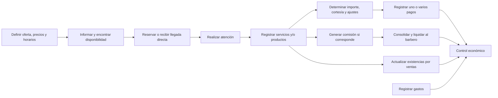
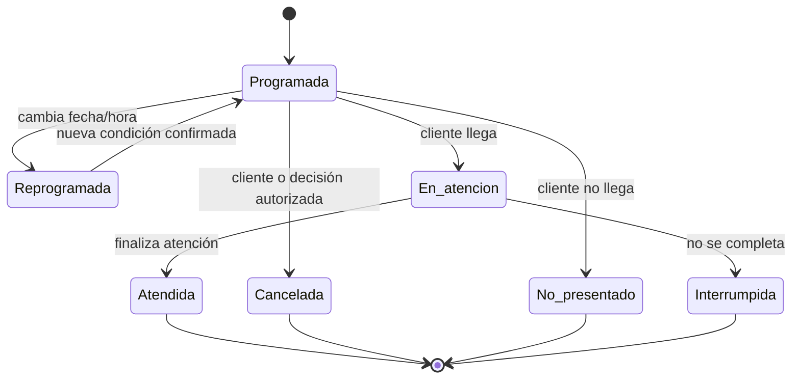
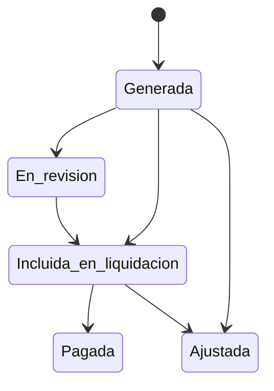

# Análisis integral del negocio — Lou Barbershop

**Versión:** 1.0  
**Fecha del análisis:** 31 de agosto de 2026  
**Alcance:** comprensión del negocio y levantamiento de necesidades previo al diseño tecnológico  
**Ubicación del negocio:** Tarija, Bolivia

---

## 1. Propósito y criterio del documento

Este documento representa el funcionamiento conocido de Lou Barbershop sin presuponer una arquitectura, una aplicación, una base de datos ni integraciones. Su propósito es servir como base verificable para conversar con el propietario, corregir o completar el entendimiento del negocio y, solamente después, derivar requerimientos de una solución.

Se usan cuatro marcas para no confundir hechos con propuestas:

- **Confirmado:** fue indicado expresamente en el contexto recibido.
- **Derivado:** conclusión necesaria o muy directa a partir de varios hechos confirmados. Debe validarse si cambia una decisión relevante.
- **Pendiente:** información necesaria que el contexto no define.
- **Recomendación:** práctica sugerida; no es una regla vigente de Lou Barbershop.

### 1.1 Límites de este análisis

No se definen aquí tecnologías, pantallas, autenticación, tablas, APIs, arquitectura ni una integración obligatoria con WhatsApp o Google Calendar. Tampoco se dan por vigentes políticas de anticipos, devoluciones, descuentos, crédito, tolerancia a atrasos, sanciones por inasistencia, impuestos, facturación o control de caja porque no fueron descritas.

---

## 2. Resumen ejecutivo

Lou Barbershop compite por calidad y experiencia, y combina tres circuitos que actualmente están parcialmente separados:

1. **Demanda y agenda:** el cliente consulta principalmente por WhatsApp; administración coordina disponibilidad y registra citas en Google Calendar. También existen clientes sin reserva.
2. **Operación:** un barbero realiza uno o más trabajos durante una atención. La cita planificada y la atención efectivamente realizada no son lo mismo: una cita puede cambiar, cancelarse o no concretarse, y una atención puede originarse sin cita.
3. **Economía:** una atención o venta genera cargos, cobros posiblemente mixtos, ingresos y, cuando interviene un barbero contratado, comisiones que quedan pendientes hasta una liquidación posterior. Los gastos se anotan manualmente y los productos requieren seguimiento de existencias.

El rasgo estructural más importante es el papel dual del dueño. Es una sola persona que actúa con dos roles: propietario/administrador y barbero. Sus atenciones forman parte de la operación normal, pero no generan una comisión a pagarle como si fuera un contratado. Esto no impide medir su producción como barbero por separado del resultado general del negocio.

Los principales riesgos de control son:

- confundir una reserva con un servicio efectivamente prestado;
- confundir el importe cobrado al cliente con ingreso, utilidad o efectivo disponible;
- perder la deuda acumulada con cada barbero entre la operación y la liquidación;
- recalcular el pasado con precios o porcentajes actuales;
- duplicar o desalinear citas si Google Calendar y una futura herramienta registran lo mismo;
- omitir atenciones sin reserva, cortesías, pagos divididos o ventas de productos;
- reducir existencias sin poder explicar qué venta, uso, ajuste o abastecimiento produjo el cambio;
- atribuir al dueño el “100 % de ganancia” sin separar cobro, costo del producto, gastos y utilidad real.

La prioridad de negocio no es reemplazar todas las herramientas actuales. Es conseguir trazabilidad con el menor esfuerzo operativo posible: registrar qué ocurrió realmente, quién lo hizo, cuánto correspondía cobrar, cuánto se cobró, por qué medios, qué comisión se generó y cuándo se liquidó.

---

## 3. Objetivos del negocio observados

### 3.1 Confirmados

- Competir principalmente por calidad del servicio y experiencia del cliente, no por precio bajo.
- Facilitar al máximo la reserva desde teléfono.
- Mantener una operación práctica para barberos que trabajan mientras consultan o registran información.
- Dar apoyo a administración en la coordinación de agenda y atención al cliente.
- Permitir al dueño controlar servicios, ventas, cobros, comisiones, gastos y desempeño.
- Obtener resultados económicos desde registros operativos y reducir cálculos manuales.
- Conservar la flexibilidad de precios, servicios, horarios y condiciones por barbero.

### 3.2 Resultado de negocio esperado — derivado

La información debe permitir reconstruir cada movimiento desde su origen hasta su efecto económico sin aumentar innecesariamente los pasos del cliente o del personal. “Reconstruir” significa poder responder, al menos: qué ocurrió, cuándo, con qué cliente si fue identificado, qué barbero intervino, qué se cobró, cómo se pagó, qué comisión nació, si ya fue liquidada y qué cambios posteriores existieron.

---

## 4. Actores, roles y responsabilidades

### 4.1 Cliente

**Objetivos:** conocer opciones, hallar disponibilidad, reservar con pocos pasos, modificar o cancelar, recibir la atención acordada, comprar productos y pagar de forma conveniente.

**Necesita como mínimo:** servicios ofrecidos, barberos disponibles cuando la elección sea relevante, precio aplicable, duración suficiente para elegir un horario y confirmación de la reserva. La información exacta que debe entregar para identificarse está pendiente.

**Variantes reales:** puede preferir un barbero, aceptar otro, pedir cualquiera disponible, llegar sin reserva, esperar, retirarse, no presentarse o recibir una cortesía.

### 4.2 Persona administrativa o secretaria

**Responsabilidades confirmadas:** responder WhatsApp, explicar disponibilidad, coordinar reservas, registrar y gestionar citas en Google Calendar.

**Necesidades derivadas:** ver disponibilidad fiable por barbero y duración; registrar rápidamente altas, cambios, cancelaciones, inasistencias y llegadas sin reserva; evitar doble reserva; consultar precios aplicables; conocer qué pasó con la cita; y apoyar el cierre económico si esa responsabilidad le corresponde. Esta última responsabilidad está pendiente de confirmar.

### 4.3 Barbero contratado

**Responsabilidades conocidas:** prestar servicios, consultar sus citas y disponibilidad, y generar ventas de productos. Debe avisar personalmente al dueño si una emergencia le impide atender; no decide unilateralmente cancelar sus citas.

**Necesidades derivadas:** agenda personal clara, cambios oportunos, registro sencillo de atenciones y ventas, detalle comprensible de comisiones generadas, liquidaciones y diferencias.

**Límite de autoridad confirmado:** no cancela unilateralmente citas por una indisponibilidad propia. No están definidos otros permisos administrativos.

### 4.4 Dueño como propietario/administrador

**Responsabilidades:** administrar y controlar el negocio, decidir ante indisponibilidad de un barbero, revisar la situación económica y pagar liquidaciones.

**Necesita:** visión global y detalle verificable; separación entre operaciones del negocio, producción de cada barbero, obligaciones pendientes por comisión, pagos realizados, gastos, productos y existencias.

### 4.5 Dueño como barbero

Participa en la agenda, presta servicios y puede estar asociado a ventas. Puede tener precios distintos. Sus operaciones deben medirse como las de cualquier prestador para efectos operativos, pero no crean una deuda de comisión a un empleado.

### 4.6 Distinción esencial entre persona y rol

**Regla derivada:** el dueño no debe duplicarse conceptualmente en dos personas. Una persona puede ejercer varios roles. Las autorizaciones, responsabilidades y consecuencias económicas dependen del rol con el que actúa en cada proceso.

### 4.7 Actores externos o futuros — pendientes

- Proveedores de productos: su existencia es natural, pero identidad, relación y proceso de compra no están definidos.
- Entidad o canal que procesa QR: no se especifica proveedor, conciliación, comisiones o tiempo de acreditación.
- Contador, autoridad tributaria u otros terceros: no fueron mencionados.
- Google Calendar y WhatsApp son herramientas/canales, no responsables del negocio.

---

## 5. Mapa de capacidades del negocio

| Capacidad | Situación conocida | Necesidad principal |
|---|---|---|
| Gestionar oferta | Catálogo dinámico; duración variable | Vigencia y cambios sin alterar el pasado |
| Gestionar precios | Varían por servicio y barbero | Saber qué precio correspondía en la fecha de la operación |
| Gestionar personal | Horarios y condiciones diferentes | Disponibilidad y condiciones individuales |
| Atender consultas | Principalmente por WhatsApp | Respuesta rápida y consistente |
| Gestionar agenda | Google Calendar; reservas y cambios | Evitar conflictos considerando duración |
| Atender sin reserva | Ocurre según disponibilidad | Incluir la atención sin crear una cita ficticia previa |
| Ejecutar atenciones | Servicios pagados o de cortesía | Registrar lo realmente realizado |
| Cobrar | Efectivo, QR o mezcla | Descomponer un cobro en varios medios |
| Vender productos | Venta asociada a barbero | Importe, costo, comisión y efecto en existencias |
| Controlar existencias | Se necesita conocer cantidades | Movimientos explicables; abastecimiento pendiente |
| Registrar gastos | Actualmente en cuaderno | Clasificación, evidencia y efecto económico |
| Calcular comisiones | Condición principalmente por barbero | Cálculo reproducible por operación |
| Liquidar barberos | Cada 15 días o mes, según situación | Diferenciar generado, ajustado y pagado |
| Analizar el negocio | Mucho cálculo manual | Indicadores trazables y comparables |

---

## 6. Cadena de valor y dependencias

Dependencias críticas:

- La disponibilidad depende del horario individual, bloqueos/ausencias, reservas existentes y duración requerida.
- La reserva depende de información vigente de servicio, barbero, precio y duración; el tratamiento de cambios posteriores está pendiente.
- La comisión depende de la operación efectivamente reconocida y de las condiciones económicas aplicables en esa fecha, no del simple hecho de reservar.
- La liquidación depende de comisiones generadas aún no pagadas, posibles ajustes y pagos anteriores.
- Los reportes dependen de no borrar ni sobrescribir hechos históricos.
- El control de existencias depende de registrar tanto salidas como entradas y ajustes; hoy el circuito de entradas no está definido.

---

## 7. Procesos del negocio

### 7.1 Mantener servicios ofrecidos

**Inicio:** se decide ofrecer, modificar o dejar de ofrecer un servicio.

**Flujo conocido/derivado:**

1. Se identifica el servicio y su duración operativa.
2. Se definen los barberos que pueden realizarlo, si no todos lo hacen; esto no fue indicado y requiere validación.
3. Se establecen precios aplicables por combinación servicio–barbero cuando corresponda.
4. El servicio queda disponible durante un período.
5. Si deja de ofrecerse, se descontinúa para nuevas operaciones sin borrar las atenciones históricas.

**Excepciones/preguntas:** cambios de nombre, duración o precio; servicio temporal; servicio solo para ciertos barberos; reserva futura realizada antes de un cambio.

### 7.2 Mantener horarios y disponibilidad individual

**Flujo base:** definir días y períodos habituales por barbero; registrar excepciones; combinar esa capacidad con citas existentes y duración solicitada para obtener espacios posibles.

**No definido:** descansos, feriados, vacaciones, permisos, bloqueos personales, horas extraordinarias, tiempo entre servicios, atención simultánea o recursos físicos limitantes como número de sillones.

### 7.3 Consulta y reserva por WhatsApp

1. El cliente escribe al número del negocio.
2. Administración identifica lo necesario para buscar disponibilidad: servicio, posible preferencia de barbero y fecha/franja. El orden exacto no está fijado.
3. Administración comunica alternativas de barbero, día y hora.
4. El cliente selecciona una alternativa.
5. Administración registra la cita en Google Calendar.
6. El cliente recibe confirmación por el canal usado. El contenido y la existencia formal de esa confirmación están pendientes.

**Alternativas:**

- cliente ya eligió barbero;
- barbero preferido no tiene espacio y el cliente acepta otro;
- cliente quiere cualquier disponibilidad;
- ninguna opción conviene y no se crea reserva;
- el cliente no termina la conversación;
- aún no sabe qué servicio requiere;
- pide varios servicios o varias personas: no definido.

### 7.4 Llegada directa sin reserva

1. El cliente llega y consulta disponibilidad.
2. Se revisa quién puede atenderlo y durante cuánto tiempo.
3. Puede elegir, aceptar otra persona, esperar o retirarse.
4. Si es atendido, se registra una atención con origen **sin reserva**.
5. La atención sigue el mismo circuito de ejecución, cobro y comisión que cualquier otra.

**Regla derivada:** no es necesario inventar retroactivamente una reserva para demostrar que la atención ocurrió. Reserva y atención son hechos distintos que pueden relacionarse cuando corresponda.

### 7.5 Modificar una cita por solicitud del cliente

1. Se identifica la cita.
2. Se registra la solicitud: fecha, hora, servicio y/o barbero.
3. Se vuelve a validar disponibilidad y duración.
4. Se confirma una nueva condición o se mantiene/cancela la anterior según lo acordado.
5. Debe conservarse al menos la trazabilidad suficiente del cambio para explicar conflictos o reclamos.

**Pendiente:** quién puede aprobar cada cambio, plazo permitido, límites de cambios y efecto de un cambio de precio.

### 7.6 Cancelación, inasistencia y contingencia del barbero

**Cancelación del cliente:** la cita queda cancelada; no debe convertirse automáticamente en atención, ingreso o comisión.

**Inasistencia del cliente:** se diferencia de cancelación porque el espacio se consumió sin aviso o sin llegada. No se conoce política de tolerancia o sanción.

**Emergencia del barbero:**

1. El barbero avisa personalmente al dueño.
2. El dueño decide la actuación.
3. Las salidas posibles pueden incluir reasignar, cambiar hora/día o cancelar; cuáles se aplican y cómo se consulta al cliente deben validarse.
4. El dueño o persona autorizada realiza el cambio/cancelación.

**Regla confirmada:** el barbero no cancela unilateralmente sus propias citas.

### 7.7 Recepción y ejecución de una atención

1. El cliente llega con reserva o solicita atención directa.
2. Se identifica el barbero que efectivamente atenderá, que podría diferir del reservado.
3. Se confirma qué servicio se realiza realmente.
4. Se presta el servicio.
5. Se registra el resultado: servicio realizado, responsable, momento, importe aplicable y tratamiento especial si lo hubo.
6. Se registran productos vendidos en la misma visita o en una venta separada, según lo que realmente ocurra; esta agrupación está pendiente.
7. Se cobra o se registra cortesía total/parcial según autorización, punto que también debe definirse.
8. Se genera la comisión que corresponda al barbero contratado.

**Alternativas:** servicio cambia durante la visita; añade otro servicio; cambia barbero; atención parcialmente completada; varias personas comparten pago; uno o varios barberos participan. Todas requieren definición.

### 7.8 Cortesía o trato especial

1. Se realiza la atención de forma normal.
2. Se conserva el valor de referencia y/o importe que habría correspondido, si el negocio decide medir el costo comercial de la cortesía.
3. Se registra el importe efectivamente cobrado, que puede ser cero.
4. Se registra el motivo y quién autorizó, si se adopta esa política.
5. Se determina si genera comisión al barbero contratado. **Este punto es crítico y no está definido.**

**Regla confirmada:** una cortesía sigue siendo un servicio realizado; no debe desaparecer de la operación.

### 7.9 Cobro con pago simple o mixto

1. Se determina el total a cobrar de servicios y/o productos.
2. Se reciben uno o varios importes.
3. Cada importe se asocia a efectivo o QR.
4. La suma se compara con el importe exigible.
5. Se deja la operación cobrada cuando corresponda.

**Pendientes:** pagos parciales o posteriores, redondeos, propinas, devoluciones, pagos fallidos por QR, comprobantes, caja física, conciliación con cuenta bancaria y quién confirma el pago.

### 7.10 Venta de productos

1. Se identifica producto, variante si existe, cantidad y precio de venta vigente.
2. Se identifica el barbero relacionado con la venta.
3. Se calcula el importe y se registra el cobro.
4. Se reduce la existencia.
5. Se calcula comisión cuando el vendedor es contratado, conforme a una regla aún por precisar.
6. Si la venta corresponde al dueño, no se crea comisión a pagar a un tercero.

**Pendientes:** devoluciones, productos defectuosos, descuentos, ventas sin barbero, quién recibe crédito por la venta, comisión sobre precio o margen, y costo por unidad/lote.

### 7.11 Abastecimiento y ajuste de productos

El contexto confirma que se necesitan cantidades disponibles, pero no define proveedores ni compras. Para que una cantidad sea confiable necesariamente deben poder explicarse sus aumentos y disminuciones.

**Proceso mínimo derivado, sujeto a validación:** registrar una existencia inicial; registrar entradas de producto; restar ventas; registrar pérdidas, consumo interno, daños o correcciones cuando ocurran; y realizar conteos físicos periódicos. Proveedor, orden de compra, deuda y pago de compra quedan fuera hasta ser levantados.

### 7.12 Registro de gastos

1. Ocurre un gasto del negocio.
2. Se registra fecha, concepto, importe y forma de pago.
3. Se clasifica con una categoría validada.
4. Idealmente se conserva respaldo y responsable del registro; es recomendación, no práctica confirmada.
5. El gasto alimenta el control económico.

### 7.13 Generación de comisión

1. Se confirma una operación efectivamente realizada o una venta válida.
2. Se identifica al barbero contratado relacionado.
3. Se recupera la condición económica válida para ese barbero en la fecha de la operación.
4. Se identifica la base de cálculo y el porcentaje o modalidad.
5. Se registra el importe de comisión generado, vinculado a su operación de origen.
6. Queda pendiente de liquidación hasta que sea incluido en un pago.

**No debe ocurrir:** calcular comisión solo a partir de las citas, pagarla implícitamente al cobrar al cliente o recalcular operaciones antiguas cuando cambia el porcentaje.

### 7.14 Liquidación y pago al barbero

1. Se determina el período o corte aplicable, normalmente quincenal o mensual según la situación.
2. Se reúnen comisiones generadas y todavía no liquidadas.
3. Se revisan operaciones, cortesías, anulaciones y ajustes.
4. Se obtiene total bruto, ajustes y total a pagar.
5. El dueño aprueba y se realiza el pago.
6. Se registra fecha, importe, medio y comisiones cubiertas.
7. Queda evidencia de saldo pendiente, si existe.

**Pendientes críticos:** calendario por barbero, anticipos, pagos parciales, redondeo, deducciones, reclamos, correcciones posteriores, medio de pago, constancia de conformidad y tratamiento de comisiones por operaciones anuladas/devueltas.

---

## 8. Estados del negocio

Los estados siguientes son un modelo de análisis recomendado para distinguir hechos. Sus nombres definitivos deben validarse.

### 8.1 Ciclo de una cita

**Observación:** “reprogramada” puede ser un evento histórico en vez de un estado duradero. Lo importante es conservar la condición anterior y la nueva. “En atención” e “interrumpida” solo son necesarios si aportan valor operativo real.

### 8.2 Ciclo de una atención

- **Iniciada:** el trabajo comenzó.
- **Realizada:** el trabajo reconocido como completado.
- **Interrumpida/no completada:** ocurrió actividad, pero no terminó normalmente.
- **Anulada administrativamente:** solo para corregir un registro erróneo; no debería borrar la huella.

Una atención sin cobro puede estar realizada. Una cita atendida debe vincularse a la atención real, pero sus servicios, barbero o precio pueden haber cambiado.

### 8.3 Situación de cobro

- Sin importe exigible: cortesía total u otra razón validada.
- Pendiente, parcial o pagado: solo si el negocio permite pagos no completos; está pendiente de confirmación.
- Devuelto/anulado: solo si existen devoluciones; pendiente.

### 8.4 Situación de comisión

El estado “en revisión” es opcional. Un ajuste debe conservar el importe original y la razón; no sobrescribir silenciosamente el pasado.

---

## 9. Reglas de negocio consolidadas

### 9.1 Confirmadas

**RN-01.** El dueño es propietario/administrador y también barbero.  
**RN-02.** Los barberos contratados trabajan por comisión, sin sueldo fijo adicional según la información conocida.  
**RN-03.** Las condiciones de comisión pueden diferir por barbero.  
**RN-04.** El precio de un servicio puede depender del servicio y del barbero que lo realiza.  
**RN-05.** Los valores de 70 Bs y 50 Bs son ejemplos, no tarifas vigentes obligatorias.  
**RN-06.** Cuando el dueño realiza un servicio no se paga comisión a otro barbero; el contexto lo describe como 100 % para el dueño.  
**RN-07.** La comisión de contratados se paga posteriormente, normalmente cada 15 días o cada mes según la situación.  
**RN-08.** Cobro al cliente, registro de ingreso, cálculo de comisión y pago de comisión son momentos distintos.  
**RN-09.** El catálogo de servicios cambia con el tiempo.  
**RN-10.** Los servicios pueden tener duraciones diferentes.  
**RN-11.** Cada barbero puede tener días, horas o turnos diferentes.  
**RN-12.** La disponibilidad considera horario individual, citas existentes y duración.  
**RN-13.** Un cliente puede ser atendido por distintos barberos; no existe asignación obligatoria ni “favorito” como regla.  
**RN-14.** Se aceptan atenciones con reserva y sin reserva.  
**RN-15.** Una cortesía sigue siendo una atención realizada y puede tener importe cobrado cero.  
**RN-16.** El cliente puede cancelar, no presentarse o solicitar cambios de fecha, hora, servicio o barbero.  
**RN-17.** Un barbero con impedimento debe avisar personalmente al dueño.  
**RN-18.** El barbero no cancela unilateralmente sus propias citas; el dueño decide y realiza o dispone el cambio.  
**RN-19.** Un cobro puede ser efectivo, QR o combinación de ambos.  
**RN-20.** La venta de productos se relaciona con un barbero y puede generar comisión conforme a sus condiciones.  
**RN-21.** Los productos pueden tener marca, precio, costo y cantidad disponible.  
**RN-22.** Los gastos se registran hoy manualmente en un cuaderno.  
**RN-23.** WhatsApp es el principal canal actual y Google Calendar la herramienta de citas.  
**RN-24.** No se ha decidido reemplazar ni integrar obligatoriamente WhatsApp o Google Calendar.  
**RN-25.** El contexto principal de uso es móvil; administración usa sobre todo una tablet.

### 9.2 Derivadas y pendientes de validación

**RD-01.** Una cita no genera ingreso ni comisión hasta que exista una operación reconocida como realizada.  
**RD-02.** Una atención sin reserva debe registrarse sin exigir una reserva previa ficticia.  
**RD-03.** Descontinuar un servicio, producto o barbero para nuevas operaciones no debe borrar el historial.  
**RD-04.** El precio, costo y condición de comisión usados deben quedar fijados en la operación histórica.  
**RD-05.** La suma de componentes de pago debe coincidir con el total efectivamente pagado.  
**RD-06.** Una comisión pagada debe poder rastrearse a una liquidación y a las operaciones que la originaron.  
**RD-07.** La existencia de producto debe resultar de movimientos explicables, no solo de un número reemplazable.  
**RD-08.** El barbero efectivamente responsable, no necesariamente el reservado, es el que debe atribuirse a la atención y a la comisión.  
**RD-09.** Los cambios y anulaciones económicas requieren motivo y trazabilidad, al menos cuando afectan comisiones, caja o inventario.  
**RD-10.** Si dos herramientas mantienen citas, debe existir una regla explícita sobre cuál dato prevalece y cómo se evitan duplicados.

---

## 10. Modelo conceptual de información del negocio

Este modelo expresa conceptos y relaciones, no tablas ni una propuesta de base de datos.

### 10.1 Núcleo de personas y roles

- **Persona:** identidad humana básica.
- **Rol en el negocio:** dueño, administrador, barbero o cliente. Una persona puede acumular roles; el dueño es el caso confirmado.
- **Barbero:** persona que presta servicios, con situación laboral/operativa y condiciones económicas vigentes por período.
- **Cliente:** persona atendida o que reserva. La atención ocasional podría requerir datos mínimos; obligatoriedad e identificación están pendientes.

### 10.2 Oferta y capacidad

- **Servicio:** tipo de trabajo ofrecido, con nombre, estado/vigencia y duración de referencia.
- **Precio aplicable:** relación histórica entre servicio, barbero, importe y período de vigencia.
- **Habilidad/oferta por barbero:** necesaria solo si no todos realizan todos los servicios; pendiente.
- **Horario de trabajo:** períodos recurrentes o específicos por barbero.
- **Excepción de disponibilidad:** ausencia, bloqueo o ampliación puntual; proceso pendiente.

### 10.3 Demanda, agenda y atención

- **Solicitud/consulta:** conversación previa que puede o no terminar en cita. Registrar cada consulta solo se recomienda si el beneficio comercial justifica el esfuerzo.
- **Cita:** compromiso planificado con cliente, barbero, inicio, duración y servicio esperado.
- **Cambio de cita:** evento que conserva condición anterior, nueva condición, momento, actor y razón cuando sea relevante.
- **Atención:** hecho operativo real, con origen reservado o directo, barbero efectivo y tiempos reales si interesa medirlos.
- **Detalle de servicio realizado:** uno o más servicios dentro de una atención; si solo se permite uno, debe confirmarse.
- **Trato especial/cortesía:** ajuste comercial con tipo, importe y posible autorización.

### 10.4 Venta, cobro y economía

- **Producto:** artículo comercializable, marca y presentación/variante cuando aplique.
- **Venta:** operación con uno o más productos, cantidades, precios y barbero relacionado.
- **Cargo/total exigible:** importe que corresponde cobrar por servicios y productos tras ajustes.
- **Pago:** entrega de valor con fecha e importe.
- **Componente de pago:** parte de un pago en efectivo o QR; permite mezcla.
- **Gasto:** salida económica de operación, con concepto y clasificación.
- **Comisión generada:** obligación calculada para un barbero a partir de un servicio o venta.
- **Liquidación:** agrupación revisada de comisiones y ajustes para un barbero y período.
- **Pago de liquidación:** desembolso posterior que cancela total o parcialmente la obligación, si los pagos parciales se permiten.

### 10.5 Existencias

- **Movimiento de producto:** entrada, venta, consumo interno, pérdida, devolución o ajuste, según procesos que se validen.
- **Existencia:** resultado acumulado de movimientos por producto y, si hace falta, ubicación.
- **Costo histórico:** costo de la unidad vendida o criterio de valoración; no está definido y es necesario para calcular margen real de producto.

### 10.6 Relaciones cardinales de negocio

- Una persona puede ejercer varios roles.
- Un barbero puede tener varios horarios, precios y condiciones de comisión a lo largo del tiempo.
- Un servicio puede ser realizado muchas veces y por varios barberos.
- Una cita planifica un cliente, un barbero y uno o más servicios esperados; la multiplicidad de servicios está pendiente.
- Una cita puede originar cero o una atención; si se permiten atenciones separadas desde una cita, debe definirse.
- Una atención puede existir sin cita.
- Una atención tiene al menos un servicio realizado para considerarse atención de servicio; ventas independientes son posibles pero no confirmadas.
- Una operación económica puede recibir varios componentes de pago.
- Una operación puede generar cero o varias comisiones si participan varios barberos; participación múltiple está pendiente.
- Una liquidación corresponde a un barbero e incluye varias comisiones.
- Una comisión no debería pertenecer a más de una liquidación pagada salvo que se modele pago parcial explícito.
- Una venta produce uno o más movimientos de salida de existencias.

---

## 11. Diccionario semántico mínimo

| Término | Significado para este análisis | No confundir con |
|---|---|---|
| Reserva/cita | Compromiso futuro planificado | Atención realizada |
| Atención | Visita o trabajo operativo efectivamente ocurrido | Cobro |
| Servicio realizado | Trabajo concreto prestado | Tipo del catálogo |
| Precio | Valor comercial aplicable | Importe cobrado |
| Cortesía | Servicio realizado cuyo cobro se reduce o elimina | Cancelación |
| Cobro/pago del cliente | Dinero recibido por uno o varios medios | Ingreso devengado o utilidad |
| Comisión generada | Obligación a favor del barbero | Comisión pagada |
| Liquidación | Agrupación y determinación de lo adeudado | Transferencia o entrega de dinero |
| Venta de producto | Intercambio comercial de artículo | Movimiento físico aislado |
| Existencia | Cantidad explicada por movimientos | Compra a proveedor |
| Gasto | Salida atribuible al negocio | Comisión, salvo decisión contable posterior |
| Producción del dueño | Servicios/ventas atribuibles a su trabajo como barbero | Utilidad total del propietario |

**Aclaración crítica:** la frase “100 % de ganancia para el dueño” parece expresar que no se descuenta comisión de contratado. No demuestra que todo lo cobrado sea utilidad neta, porque pueden existir costos de producto, insumos, gastos e impuestos. Debe validarse el vocabulario que usa el negocio.

---

## 12. Información histórica que debe preservarse

Para evitar que el presente reescriba el pasado, se necesita conservar:

- servicios y productos ya descontinuados que aparezcan en operaciones previas;
- precio aplicado, no solo el precio actual;
- duración prevista y, si se mide, duración real;
- barbero reservado y barbero que efectivamente atendió;
- condición y porcentaje/base de comisión aplicada;
- costo de producto relevante al momento de vender, si se medirá margen;
- detalle original de cobro y sus medios;
- cortesías, descuentos o ajustes y sus motivos;
- cambios, cancelaciones, inasistencias y reasignaciones relevantes;
- comisiones originales, ajustes, liquidaciones y pagos;
- movimientos de existencia;
- gastos y correcciones sin eliminación silenciosa;
- identidad de quien registró o autorizó operaciones sensibles, si se adopta control por usuario.

**Recomendación:** corregir mediante reversos o ajustes vinculados al original cuando el hecho ya tuvo impacto económico, en vez de borrar el registro.

---

## 13. Necesidades de información por actor

### 13.1 Cliente — mínima y contextual

- servicios disponibles y explicación breve;
- precios que correspondan al barbero/servicio elegido;
- alternativas reales de día, hora y barbero;
- duración o al menos hora estimada de finalización cuando sea útil;
- confirmación y vía simple para solicitar cambios/cancelación;
- datos mínimos que debe proporcionar, aún por definir.

No está justificado exigir cuenta, contraseña o perfil completo para reservar. **Recomendación:** validar una identificación liviana basada en el canal y pedir únicamente lo necesario, considerando duplicados y privacidad.

### 13.2 Barbero

- agenda propia y cambios;
- datos mínimos para reconocer la cita;
- servicio y duración previstos;
- huecos/bloqueos relevantes;
- servicios y ventas atribuidos;
- comisión por operación, acumulado pendiente y liquidaciones pagadas;
- mecanismo para reportar discrepancias. Este último no está definido.

### 13.3 Administración

- agenda consolidada por barbero;
- búsqueda de espacio basada en duración;
- precios y oferta por barbero;
- información mínima del cliente y contacto;
- estado de cada cita y procedencia de una atención;
- herramientas rápidas para reprogramar, reasignar y registrar llegada directa;
- alertas de conflicto o información incompleta;
- instrucciones claras ante contingencias.

### 13.4 Dueño

- ingresos/cobros por período, fuente y medio;
- servicios realizados y cortesías;
- producción por barbero, incluido él mismo;
- ventas y margen de productos cuando exista costo confiable;
- comisiones generadas, pendientes, liquidadas y pagadas;
- gastos y tendencia por categoría;
- flujo de efectivo y, si se define, conciliación de caja/QR;
- ocupación, cancelación e inasistencia;
- existencias, productos con baja rotación o bajo nivel, cuando se definan criterios;
- trazabilidad desde un total hasta las operaciones que lo componen.

---

## 14. Indicadores útiles para decisión

Son recomendaciones de análisis, no reportes ya aprobados. Cada indicador debe mostrar período, alcance y fuente para evitar interpretaciones ambiguas.

### 14.1 Operación y experiencia

- atenciones realizadas por día, semana y mes;
- servicios realizados por tipo y barbero;
- citas programadas, atendidas, canceladas y no presentadas;
- proporción de atenciones con reserva frente a llegada directa;
- ocupación: tiempo reservado o atendido frente a tiempo disponible;
- cambios de barbero y reprogramaciones;
- cortesías por cantidad y valor de referencia;
- demanda no atendida o clientes que se retiran: valioso, pero hoy probablemente no registrado y puede ser costoso capturarlo.

### 14.2 Economía

- valor de servicios realizados;
- importe efectivamente cobrado;
- cobros por efectivo y QR;
- ventas de productos y unidades;
- costo y margen bruto de productos, solo con costos históricos confiables;
- comisiones generadas y pagadas;
- obligaciones de comisión pendientes por barbero y antigüedad;
- gastos por categoría y período;
- resultado operativo aproximado bajo una definición acordada.

### 14.3 Personas y desempeño

- producción atribuida a cada barbero por servicios y ventas;
- ticket promedio por atención;
- mezcla de servicios;
- tasa de ocupación por barbero;
- repetición de clientes solo si existe identificación suficientemente confiable y una finalidad aceptada.

**Precaución:** comparar barberos únicamente por ingresos puede ser injusto si difieren sus precios, horarios, servicios, antigüedad o demanda. Los indicadores deben aportar contexto, no convertirse automáticamente en evaluación laboral.

---

## 15. Gastos: clasificación inicial para validar

### 15.1 Categorías que se desprenden naturalmente del contexto

- **Comisiones pagadas a barberos:** salida económica diferenciada; falta decidir si el negocio la trata como gasto para sus reportes.
- **Costo de productos destinados a reventa:** existe porque los productos tienen costo.
- **Gastos operativos generales:** confirmados como realidad, aunque no se detallaron tipos.

### 15.2 Categorías propuestas por práctica habitual, no confirmadas

- alquiler del local;
- servicios básicos: electricidad, agua, internet/telefonía;
- insumos consumibles para servicios;
- limpieza e higiene;
- mantenimiento y reparación de equipos/mobiliario;
- compra de herramientas y activos;
- marketing/publicidad;
- transporte o mensajería;
- comisiones bancarias o del medio de pago;
- impuestos, licencias y honorarios profesionales;
- capacitación;
- cortesías o descuentos como costo comercial, normalmente mejor medidos sin duplicarlos como salida de dinero;
- otros gastos extraordinarios.

**Preguntas de clasificación:** ¿se necesita distinguir gasto fijo/variable?, ¿operativo/no operativo?, ¿pagado/pendiente?, ¿deducible/no deducible?, ¿compra de inventario frente a costo de venta? Estas distinciones no deben implantarse sin confirmar quién las usará y para qué decisión.

---

## 16. Problemas y riesgos actuales o potenciales

### 16.1 Fragmentación de información

WhatsApp conserva conversaciones, Google Calendar citas y el cuaderno movimientos económicos. Es difícil unir una consulta, su reserva, la atención, el cobro y la comisión. El problema no es que las herramientas sean malas; es la falta de un vínculo común y un registro operativo completo.

### 16.2 Dependencia de conocimiento personal

Administración puede conocer de memoria horarios, precios, preferencias y excepciones. Si esa información no es explícita, otra persona puede responder distinto o tardar más.

### 16.3 Doble reserva y cálculo incorrecto de disponibilidad

Un hueco aparente puede no alcanzar para la duración del servicio. Los cambios y bloqueos no sincronizados aumentan el riesgo.

### 16.4 Operaciones omitidas

Las llegadas directas, cortesías, cambios de servicio y ventas rápidas son fáciles de no registrar. Esto distorsiona producción, existencias, comisiones y resultados.

### 16.5 Comisiones no reproducibles

Si el porcentaje actual reemplaza al anterior o la base no es clara, una liquidación no puede auditarse. También existe riesgo de pagar dos veces, omitir operaciones o discutir cortesías y descuentos.

### 16.6 Terminología económica ambigua

“Ingreso”, “cobro”, “ganancia” y “dinero del dueño” pueden usarse como sinónimos aunque representan cosas distintas. Esta ambigüedad puede producir reportes aparentemente correctos pero decisiones equivocadas.

### 16.7 Inventario sin circuito de entrada

No basta registrar ventas. Sin abastecimiento, conteos y ajustes no es posible confiar en la cantidad disponible ni calcular margen.

### 16.8 Dos fuentes de agenda

Mantener Google Calendar junto a otra solución puede ser conveniente, pero sin una regla de fuente oficial surgen duplicados, cambios perdidos y disponibilidad falsa.

### 16.9 Exceso de fricción

Un registro exhaustivo durante el trabajo puede hacer que barberos o administración lo eviten. La captura debe ocurrir en el momento natural y reutilizar datos ya disponibles.

---

## 17. Principios para una futura solución

Estas son recomendaciones orientadoras, no decisiones técnicas.

1. **Primero registrar el hecho, luego reportarlo.** Los totales deben surgir de operaciones trazables.
2. **Separar planificación de ejecución.** Cita esperada y atención real pueden diferir.
3. **Separar devengo de pago.** Comisión generada no es comisión pagada.
4. **Preservar contexto histórico.** Tarifas y porcentajes actuales no modifican el pasado.
5. **Captura mínima por actor.** El cliente no llena datos administrativos; el barbero no realiza cierres complejos mientras atiende.
6. **Excepciones de primera clase.** Llegada directa, cortesía, pago mixto, cambio y no presentación no deben resolverse con notas libres solamente.
7. **Convivencia deliberada.** Google Calendar puede permanecer si se define el propósito y autoridad de cada herramienta.
8. **Corrección trazable.** No borrar silenciosamente hechos económicos.
9. **Acceso por responsabilidad.** Cada rol ve y modifica lo necesario; el detalle exacto se definirá después.
10. **Complejidad proporcional.** No capturar un dato si nadie sabe qué decisión habilitará.

---

## 18. Necesidades funcionales del negocio, sin diseño técnico

### Prioridad esencial para control básico

- mantener servicios, duración, vigencia y precio por barbero;
- mantener horarios y excepciones individuales;
- consultar disponibilidad real considerando duración;
- registrar y modificar citas sin perder trazabilidad relevante;
- registrar atenciones reservadas y directas;
- reflejar servicio y barbero efectivamente realizados;
- registrar cortesías sin eliminar la atención;
- registrar servicios, productos y cobros mixtos;
- calcular comisión histórica conforme a la condición aplicable;
- acumular, revisar y pagar liquidaciones;
- registrar gastos;
- mantener productos y movimientos básicos de existencia;
- ofrecer al dueño resumen y detalle reconciliables.

### Prioridad alta, sujeta a definición del proceso

- manejar ausencias, bloqueos y reasignaciones;
- registrar cambios económicos con motivo/autorización;
- gestionar entradas y ajustes de productos;
- distinguir importes esperados, cobrados y pendientes si existe crédito;
- conciliar efectivo y QR si se desea control de caja;
- permitir a barberos revisar comisiones y liquidaciones;
- medir cancelaciones, no presentaciones y ocupación.

### Oportunidades posteriores, no requisitos confirmados

- reserva autónoma del cliente;
- recordatorios automáticos;
- integración bidireccional con Google Calendar;
- integración con WhatsApp;
- fidelización o promociones;
- proveedores y compras completas;
- facturación o integración contable;
- múltiples sucursales;
- analítica avanzada.

---

## 19. Convivencia con las herramientas actuales

### 19.1 WhatsApp

Debe seguir considerándose el canal de conversación principal mientras funcione para clientes y administración. Una futura solución podría simplemente apoyar a administración con información fiable y permitir compartir confirmaciones, sin integrar técnicamente el canal. Automatizar mensajes solo tendría sentido tras medir volumen, repetición de tareas y consentimiento del cliente.

### 19.2 Google Calendar

Hay tres estrategias futuras posibles, ninguna decidida:

- **Mantenerlo como agenda principal:** otra herramienta consume o referencia la información.
- **Mantenerlo como vista operativa:** el registro principal está en otro lugar y se refleja en Calendar.
- **Migrar gradualmente:** solo si aparecen limitaciones que justifican el cambio.

Antes de elegir se debe conocer: cantidad de calendarios, estructura de eventos, uso de colores/notas, quién tiene acceso, cómo se representan duración y barbero, frecuencia de cambios y qué pasa cuando no hay conexión.

### 19.3 Cuaderno

El objetivo razonable es reemplazar cálculos y consolidación manual, pero primero debe levantarse qué se anota, quién lo hace, en qué momento y qué cierres se realizan. El cuaderno puede ser evidencia del proceso real y debe revisarse con ejemplos anonimizados.

---

## 20. Preguntas pendientes priorizadas

### 20.1 Bloqueantes para definir economía y comisiones

1. ¿Cuál es la base de comisión de servicios: precio de lista, importe final cobrado u otro valor?
2. ¿La comisión de productos se calcula sobre precio de venta, utilidad/margen o una cantidad fija?
3. ¿Puede un barbero tener porcentajes diferentes por tipo de servicio o producto, o solo una condición general?
4. ¿Desde cuándo rige un cambio de porcentaje y qué pasa con operaciones anteriores?
5. ¿Una cortesía o descuento realizado por un barbero contratado genera comisión? ¿Quién asume su costo?
6. ¿Existen anticipos, descuentos, deudas del barbero, ajustes o pagos parciales en una liquidación?
7. ¿Qué significa exactamente “100 % de ganancia para el dueño” en servicios y productos?
8. ¿Cuándo se reconoce una operación para comisión: al completar, al cobrar o al cierre?
9. ¿Quién puede corregir una operación ya liquidada y cómo se compensa la diferencia?

### 20.2 Bloqueantes para agenda y atención

10. ¿Una cita puede incluir varios servicios o personas?
11. ¿Todos los barberos ofrecen todos los servicios?
12. ¿La duración cambia por barbero además de cambiar por servicio?
13. ¿Existen descansos, feriados, vacaciones, bloqueos o tiempo de preparación entre citas?
14. ¿Hay suficientes sillones/recursos para que todos atiendan a la vez?
15. ¿Qué datos mínimos se solicitan al cliente y cómo se distingue a personas con el mismo nombre?
16. ¿Qué información se registra hoy en cada evento de Google Calendar?
17. ¿Quién puede crear, reprogramar, reasignar y cancelar citas además del dueño y administración?
18. ¿Existe tolerancia por atraso o política de no presentación?
19. ¿Cómo se registra el cambio entre barbero reservado y barbero efectivo?
20. ¿Qué ocurre si el servicio real dura más y afecta la siguiente cita?

### 20.3 Pagos y caja

21. ¿Siempre se paga el total al terminar o se permiten saldos pendientes?
22. ¿Se aceptan anticipos para reservas?
23. ¿Cómo se confirma un QR y a qué cuenta llega?
24. ¿Se realiza apertura/cierre o arqueo de efectivo? ¿Quién custodia el dinero?
25. ¿Existen propinas y pertenecen al barbero o al negocio?
26. ¿Hay devoluciones, cobros erróneos o reembolsos?
27. ¿Se emite recibo o factura y existen obligaciones tributarias que deban integrarse al proceso?

### 20.4 Productos e inventario

28. ¿Quién compra, recibe y cuenta productos?
29. ¿Cómo se registran hoy abastecimientos y costos?
30. ¿Hay variantes por tamaño, aroma o presentación?
31. ¿El costo cambia por compra y qué criterio usa el negocio para calcular margen?
32. ¿Hay consumo interno, muestras, daños, pérdidas o devoluciones?
33. ¿Qué nivel de alerta o reposición sería útil?
34. ¿Puede existir una venta sin barbero asociado o con más de un responsable?

### 20.5 Gastos y control

35. ¿Qué columnas y categorías contiene hoy el cuaderno?
36. ¿Quién registra, revisa y autoriza gastos?
37. ¿Se necesita adjuntar comprobantes?
38. ¿Se registran compromisos pendientes o solo pagos ya hechos?
39. ¿Qué período usa el dueño para evaluar el negocio y qué decisiones toma con esos números?

### 20.6 Acceso, adopción y privacidad

40. ¿Qué información económica puede ver cada barbero: solo la propia o también totales?
41. ¿Administración puede ver/corregir cobros, gastos, comisiones y liquidaciones?
42. ¿Qué teléfonos/tablet y calidad de conexión se usan normalmente?
43. ¿Quién reemplaza a administración y cómo accede a la información?
44. ¿Durante cuánto tiempo se conservarán datos de clientes y para qué usos se solicitará permiso?

---

## 21. Casos de validación del modelo

Estos escenarios deben poder explicarse sin contradicciones antes de diseñar una solución:

1. Un cliente reserva corte con el dueño, cambia de hora y finalmente no se presenta: existe historial de cita, pero no atención, cobro ni comisión.
2. Un cliente llega sin reserva, acepta otro barbero y paga 30 Bs en efectivo y el resto por QR: existe atención directa, barbero efectivo, dos componentes de pago y comisión pendiente.
3. Un amigo del dueño recibe un corte gratuito del dueño: existe atención y cortesía con cobro cero; no hay comisión a tercero.
4. Un cliente recibe cortesía de un barbero contratado: la atención existe, pero la regla de comisión queda bloqueada hasta que el dueño defina quién absorbe el costo.
5. Un barbero vende dos productos de distinto costo y recibe comisión: la venta reduce existencias y genera comisión según una base todavía por definir.
6. Cambia el porcentaje del barbero a mitad de mes: operaciones anteriores conservan la condición anterior y las siguientes usan la nueva.
7. Una operación ya incluida en una liquidación resulta incorrecta: se conserva el original y se realiza un ajuste trazable en vez de borrarlo.
8. Un barbero avisa una emergencia: el dueño decide reasignar parte de sus citas y cancelar otras; cada cliente mantiene el resultado real de su cita.
9. Un servicio se descontinúa: deja de aparecer para nuevas reservas, pero continúa visible en el historial y reportes.
10. El precio cambia después de reservar pero antes de atender: el negocio debe definir si respeta el precio informado o aplica el vigente; el modelo conserva ambos hechos si es necesario.

---

## 22. Plan recomendado de descubrimiento y validación

### Fase 1 — validar la operación real

- entrevistar por separado al dueño, administración y al menos un barbero;
- observar una jornada representativa sin interferir;
- revisar ejemplos anonimizados de Calendar, cuaderno, liquidaciones y ventas;
- recorrer los diez casos de validación anteriores;
- acordar un vocabulario económico común.

### Fase 2 — cerrar decisiones de negocio

- definir base, vigencia, ajustes y cortesías de comisión;
- definir autoridad para cambios y correcciones;
- definir datos mínimos del cliente;
- definir manejo de caja/QR, inventario y gastos;
- decidir qué herramienta es fuente principal de agenda durante una transición.

### Fase 3 — priorizar resultados

- seleccionar los problemas con mayor frecuencia, costo o riesgo;
- fijar indicadores de éxito, por ejemplo tiempo para registrar una atención, diferencias de liquidación y operaciones omitidas;
- separar un primer alcance esencial de oportunidades posteriores;
- prototipar flujos móviles con usuarios reales antes de decidir arquitectura.

---

## 23. Criterios de aceptación del análisis

El levantamiento puede considerarse listo para pasar a diseño cuando:

- dueño, administración y barberos reconocen los flujos descritos;
- las preguntas económicas críticas tienen respuesta explícita;
- reserva, atención, cobro, comisión y liquidación se distinguen sin ambigüedad;
- los diez casos de validación tienen un resultado acordado;
- se conoce la información mínima que se captura en cada punto;
- se define quién puede ejecutar y corregir acciones sensibles;
- se entiende el proceso actual de Google Calendar y del cuaderno;
- se decide qué debe permanecer histórico;
- se prioriza un alcance inicial por valor y no por disponibilidad tecnológica.

---

## 24. Conclusión

Lou Barbershop no necesita inicialmente “más funcionalidades”, sino un modelo común y simple de su realidad. Ese modelo debe unir agenda, atención y economía sin confundirlas; aceptar que el dueño tiene dos roles; reconocer precios y comisiones variables; incorporar llegadas directas, cortesías y pagos mixtos; y mantener la deuda de comisión separada del dinero cobrado.

La mayor parte del valor vendrá de registrar pocas cosas en el momento correcto y conservar su historia. Las decisiones todavía abiertas —especialmente base de comisión, tratamiento de cortesías, caja, inventario y autoridad sobre correcciones— deben resolverse con el propietario antes de convertir este análisis en diseño funcional o técnico.
