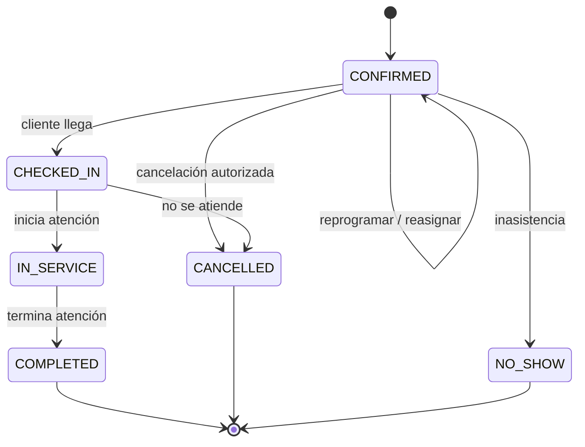
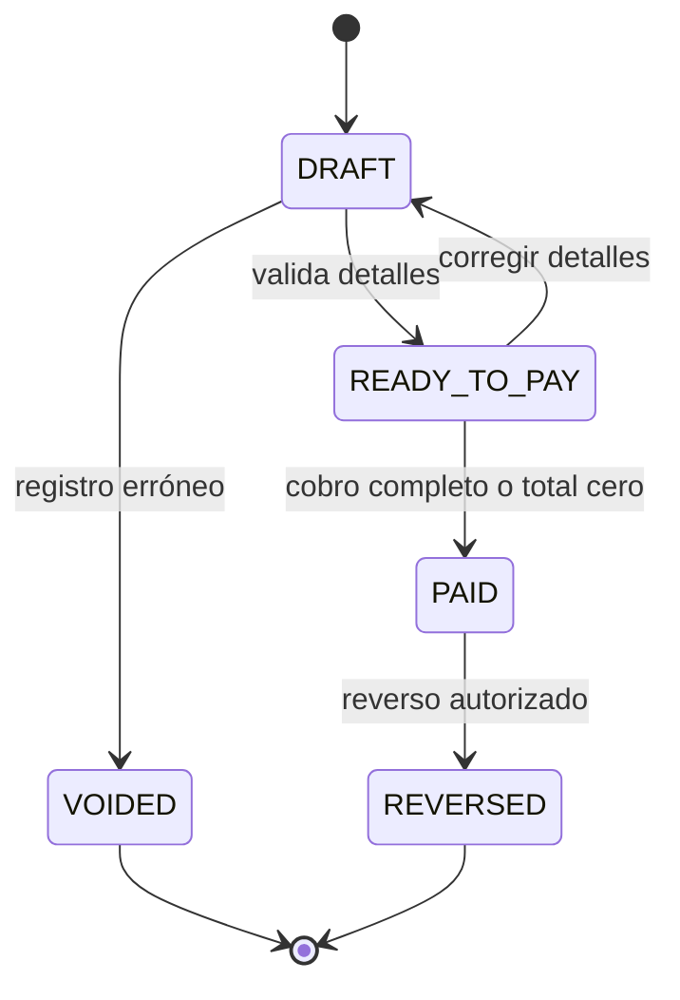
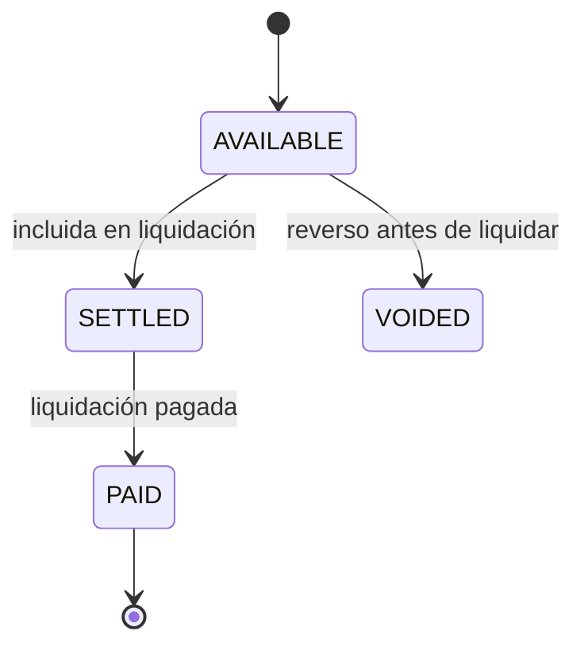
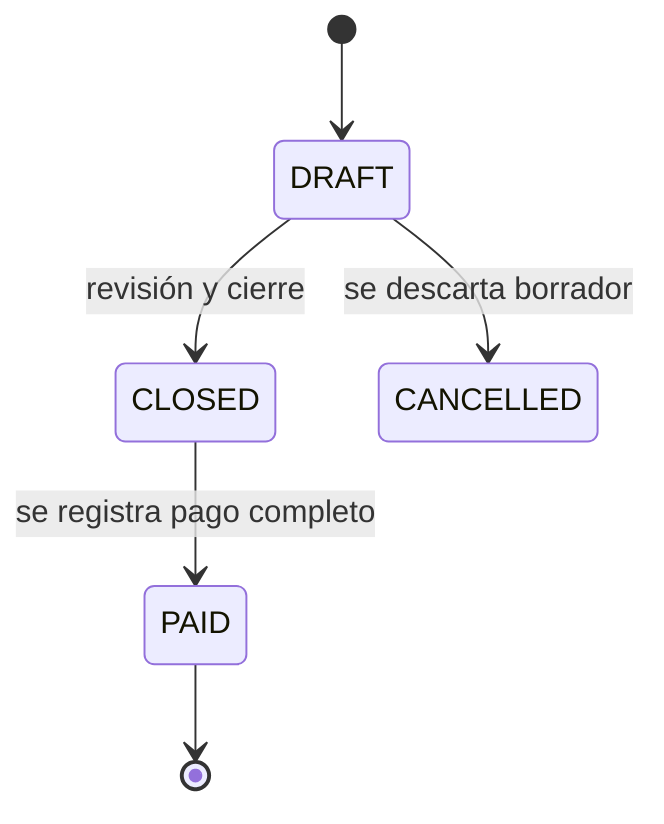

# Reglas de negocio y estados

## 1. Reglas de agenda

- **RN-AGEN-01:** un barbero no puede tener citas activas que se solapen.
- **RN-AGEN-02:** un horario ofrecido debe caber dentro del turno y no intersectar citas, bloqueos o ausencias.
- **RN-AGEN-03:** la duración aplicable es la de la oferta del barbero; si no existe sobrescritura, se usa la del servicio.
- **RN-AGEN-04:** una cita guarda servicio, barbero, precio informado, duración informada, cliente, inicio y fin.
- **RN-AGEN-05:** elegir “cualquier barbero” significa seleccionar uno concreto disponible antes de confirmar.
- **RN-AGEN-06:** una reprogramación conserva un evento de auditoría con condición anterior y nueva.
- **RN-AGEN-07:** cancelar o marcar inasistencia no genera atención, cobro ni comisión.
- **RN-AGEN-08:** solo dueño y administración pueden cancelar o reasignar una cita por indisponibilidad del barbero.
- **RN-AGEN-09:** el barbero puede informar indisponibilidad, pero no cancelar unilateralmente sus citas.
- **RN-AGEN-10:** una llegada directa puede crear una atención sin cita.

## 2. Reglas de atención y precios

- **RN-ATE-01:** lo realizado prevalece sobre lo reservado para producción, cobro y comisión.
- **RN-ATE-02:** una atención tiene un barbero responsable y puede contener varios servicios/productos.
- **RN-ATE-03:** los importes se congelan en cada detalle de operación; cambiar el catálogo no cambia el historial.
- **RN-ATE-04:** el descuento se registra por detalle o sobre el total, con motivo.
- **RN-ATE-05:** una cortesía requiere dueño o administración y motivo obligatorio.
- **RN-ATE-06:** una atención de cortesía sigue contando como trabajo realizado.
- **RN-ATE-07:** un servicio/producto inactivo no puede añadirse a nuevas operaciones, pero sigue visible en las antiguas.
- **RN-ATE-08:** una operación cerrada debe tener al menos un detalle de servicio o producto.
- **RN-ATE-09:** el total neto nunca puede ser negativo.
- **RN-ATE-10:** la atención conserva su origen: reserva o llegada directa.

## 3. Reglas de cobro

- **RN-PAG-01:** los únicos medios del MVP son `CASH` y `QR`.
- **RN-PAG-02:** pueden existir uno o dos componentes de pago, uno por medio.
- **RN-PAG-03:** para cerrar como pagada, la suma de componentes debe ser igual al total neto.
- **RN-PAG-04:** un total cero no requiere componente de pago.
- **RN-PAG-05:** no se permite sobrepago, saldo pendiente ni pago negativo.
- **RN-PAG-06:** anular una operación pagada requiere permiso del dueño y un reverso auditable; la devolución física se gestiona fuera del MVP.

## 4. Reglas de comisiones y liquidaciones

- **RN-COM-01:** solo los barberos contratados generan comisiones a pagar.
- **RN-COM-02:** cada condición tiene tipo `SERVICE` o `PRODUCT`, tasa y vigencia sin solapamiento para el mismo barbero/tipo.
- **RN-COM-03:** comisión normal = base neta × tasa congelada.
- **RN-COM-04:** en cortesía de servicio de un contratado, la base es el precio previo a la cortesía.
- **RN-COM-05:** un producto de cortesía tiene comisión cero salvo ajuste posterior autorizado.
- **RN-COM-06:** cada comisión referencia exactamente un detalle de operación o un ajuste explícito.
- **RN-COM-07:** cerrar/cobrar la operación genera las comisiones de forma atómica.
- **RN-COM-08:** una comisión solo puede incluirse una vez en una liquidación.
- **RN-COM-09:** una liquidación pertenece a un barbero y no mezcla monedas ni personas.
- **RN-COM-10:** una liquidación pagada es inmutable; correcciones posteriores pasan a la siguiente mediante ajuste.
- **RN-COM-11:** los ajustes requieren importe con signo, motivo y usuario autorizador.
- **RN-COM-12:** el importe a pagar es suma de comisiones más ajustes y no puede ser negativo.

## 5. Reglas de productos e inventario

- **RN-INV-01:** la existencia se deriva de movimientos, no de sobrescribir una cifra.
- **RN-INV-02:** una venta confirmada crea una salida por cada detalle de producto.
- **RN-INV-03:** no se permite vender más cantidad que la disponible, salvo corrección autorizada del dueño.
- **RN-INV-04:** toda recepción registra productos, cantidades, costos unitarios, total pagado, medio, fecha y responsable.
- **RN-INV-05:** todo ajuste registra tipo y motivo.
- **RN-INV-06:** el costo promedio se recalcula con entradas; una salida conserva su costo asignado.
- **RN-INV-07:** desactivar un producto no elimina sus movimientos.
- **RN-INV-08:** una compra para reventa no se registra además como gasto operativo; su pago forma parte de la recepción de inventario.

## 6. Reglas de gastos y reportes

- **RN-GAS-01:** un gasto requiere fecha, concepto, categoría, importe y medio de pago.
- **RN-GAS-02:** el importe debe ser mayor que cero.
- **RN-GAS-03:** solo se registran gastos pagados en el MVP.
- **RN-GAS-04:** eliminar un gasto con impacto en reportes requiere reverso o anulación auditada.
- **RN-REP-01:** los reportes distinguen ventas/cargos, cobros, comisiones generadas, comisiones pagadas, gastos y margen.
- **RN-REP-02:** la producción del dueño se reporta, pero no como comisión por pagar.
- **RN-REP-03:** todo total económico debe permitir llegar a su detalle de origen.

## 7. Invariantes críticos

1. `total_neto = subtotal - descuentos - cortesias`, con mínimo cero.
2. Si una operación está `PAID`, `sum(pagos) = total_neto`.
3. La suma de cantidades de inventario por movimiento produce la existencia visible.
4. Una comisión liquidada no puede entrar en otra liquidación.
5. El porcentaje histórico de comisión no cambia aunque se edite la condición actual.
6. Una cita activa no solapa otra del mismo barbero.
7. Una cortesía nunca elimina el servicio realizado.

## 8. Máquinas de estado

### 8.1 Cita

### 8.2 Atención/operación

### 8.3 Comisión

### 8.4 Liquidación

## 9. Redondeo

Los cálculos monetarios se hacen en enteros de centavos. La comisión se redondea al centavo más cercano con regla `half-up` en cada detalle, no solo en el total de la liquidación. Esto permite reproducir el importe exacto de cada operación.
