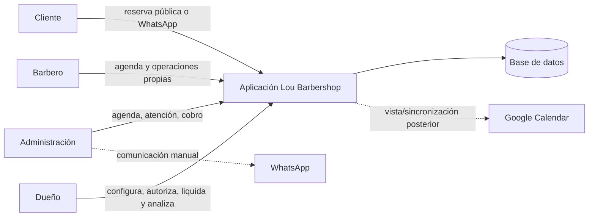
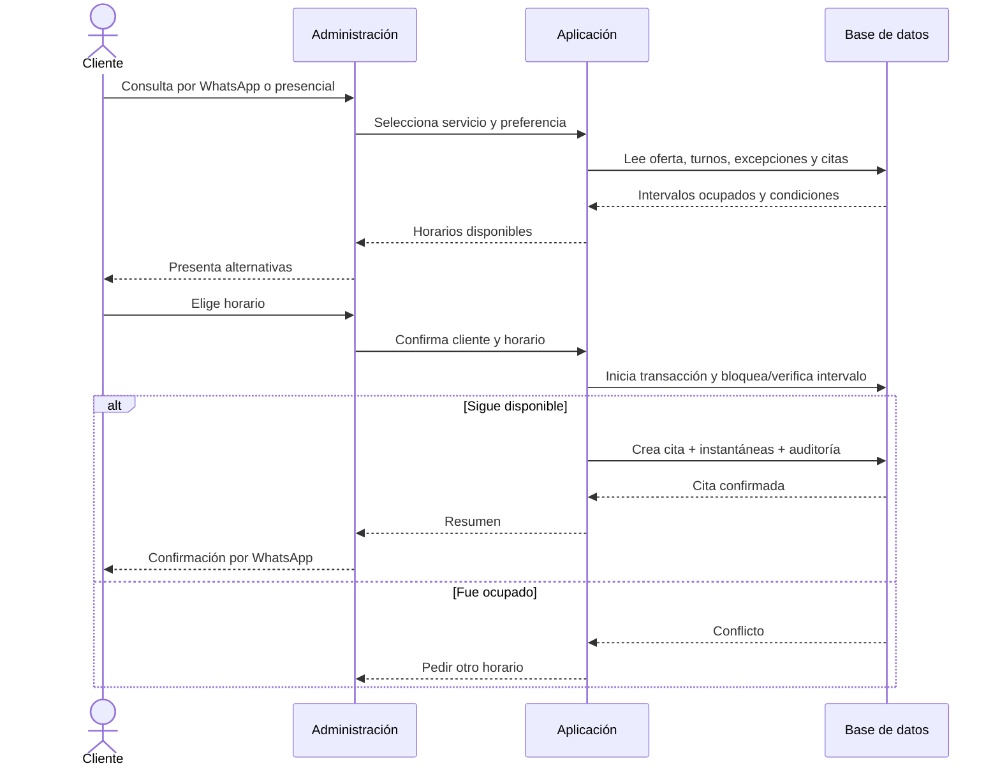
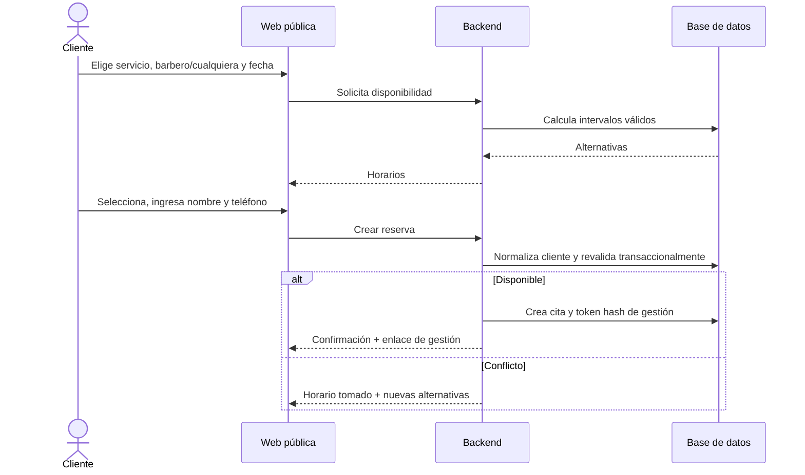
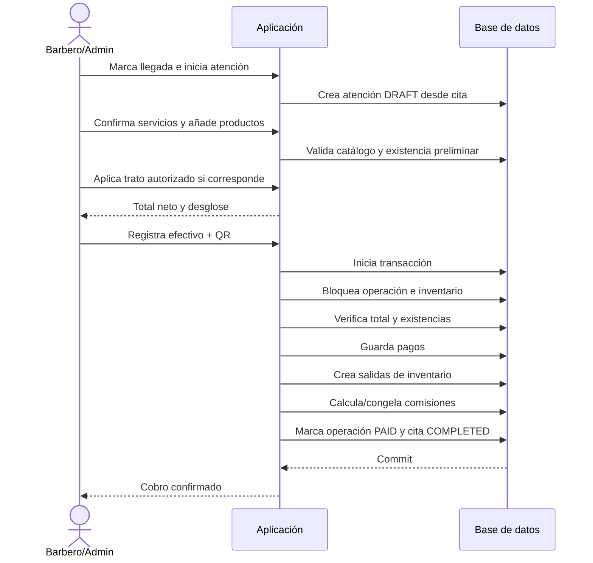
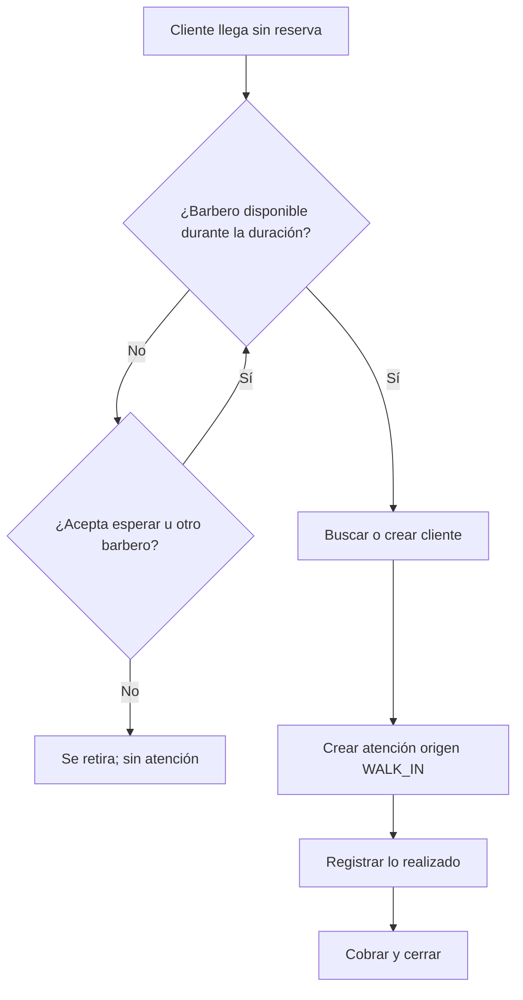
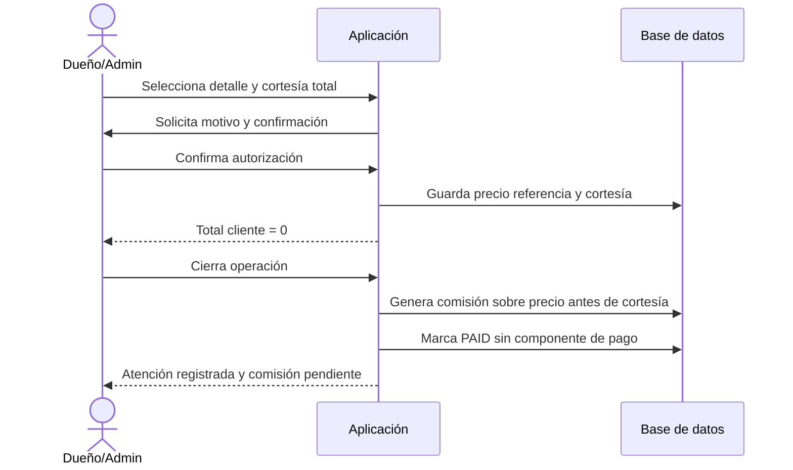
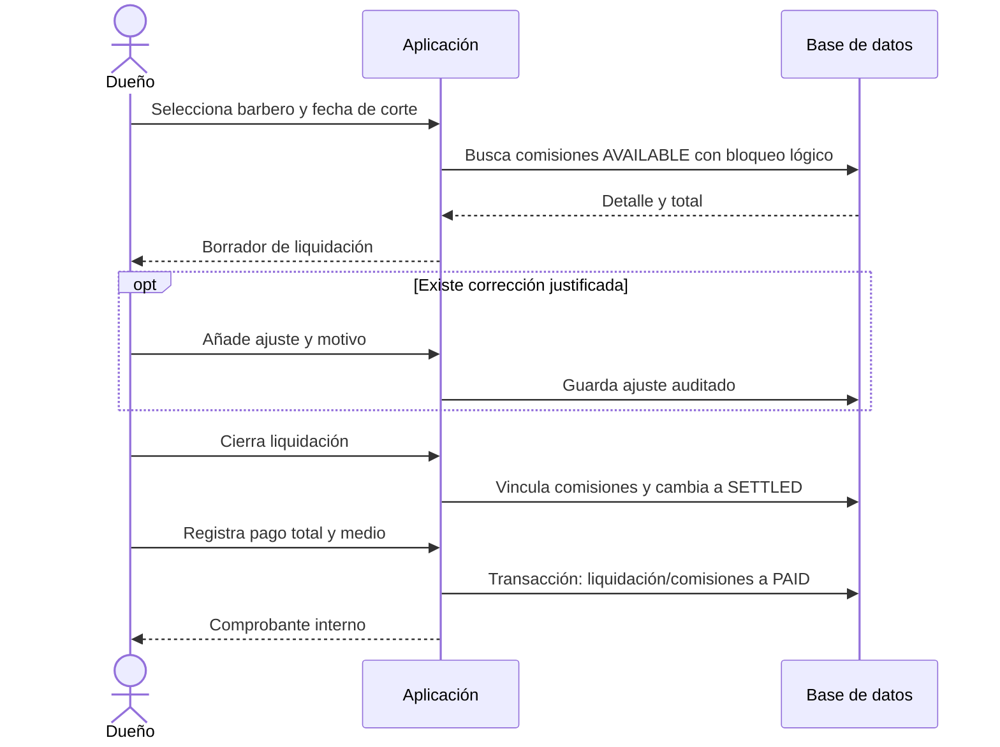
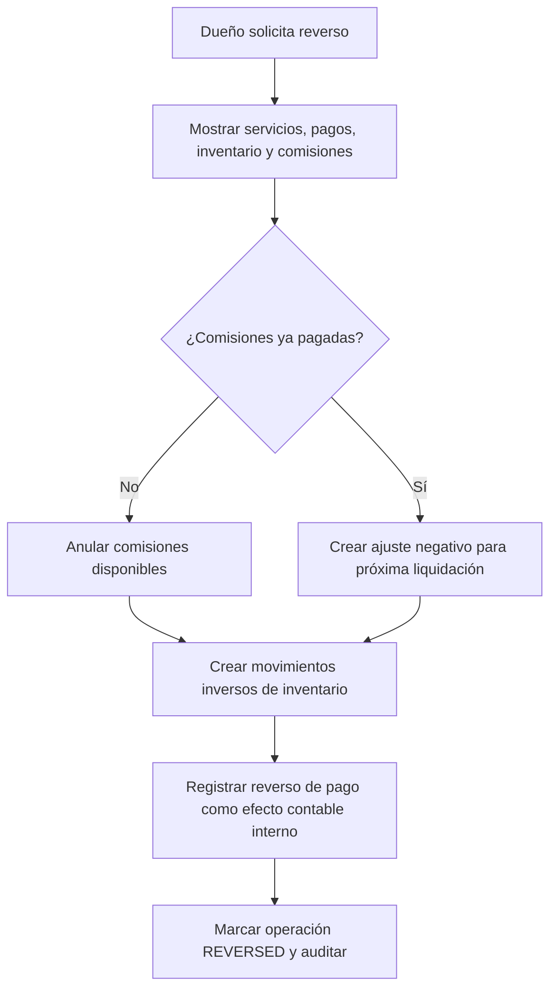
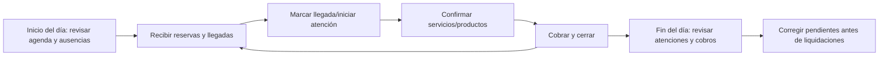

# Flujos y diagramas de secuencia

## 1. Contexto del sistema

WhatsApp continúa como canal humano. Google Calendar no es fuente editable paralela en el MVP.

## 2. Reserva interna

## 3. Reserva pública sin cuenta

El token en claro solo se entrega al crearlo; la base conserva su hash. No se utiliza el teléfono como autorización.

## 4. Atención reservada y cobro mixto

Si cualquier validación falla, se revierte toda la transacción: no puede existir pago sin comisión o salida de inventario correspondiente.

## 5. Llegada directa

Registrar que alguien se retiró sin atención queda fuera del MVP; podría añadirse después para medir demanda perdida.

## 6. Cortesía de servicio de barbero contratado

## 7. Liquidación

## 8. Reverso de operación pagada

La devolución efectiva de dinero al cliente no se automatiza en el MVP; el sistema deja constancia del reverso y el dueño gestiona la entrega.

## 9. Flujo diario recomendado

No se exige un cierre de caja formal en el MVP, pero el panel diario muestra efectivo y QR para comparación manual.

