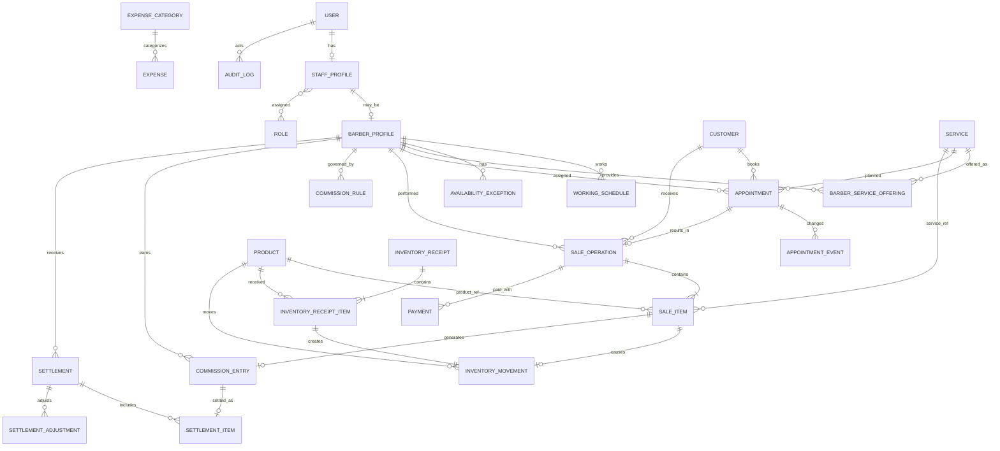

# Modelo de dominio y datos

## 1. Criterios de modelado

- Modelo relacional en PostgreSQL.
- Identificadores UUID.
- Importes como `BIGINT` en centavos de BOB.
- Tasas como enteros en puntos base: `2500 = 25,00 %`.
- Instantes como `TIMESTAMPTZ`; fechas operativas como `DATE` cuando no representan un instante.
- Eliminación lógica mediante `active` o `archived_at` para catálogos.
- `created_at`, `updated_at` y `version` en agregados editables.
- Instantáneas en transacciones históricas aunque exista referencia al catálogo.

## 2. Agregados del dominio

### Identidad y personal

- `User`: credenciales y estado de acceso.
- `StaffProfile`: persona interna y roles.
- `BarberProfile`: atributos operativos del barbero.
- `Customer`: datos mínimos del cliente.

### Catálogo y agenda

- `Service` y `BarberServiceOffering`.
- `WorkingSchedule` y `AvailabilityException`.
- `Appointment` y `AppointmentEvent`.

### Operación económica

- `SaleOperation`, `SaleItem`, `Payment`.
- `CommissionEntry`, `CommissionRule`, `Settlement`, `SettlementItem`, `SettlementAdjustment`.
- `Product`, `InventoryReceipt`, `InventoryReceiptItem`, `InventoryMovement`.
- `Expense`, `ExpenseCategory`.
- `AuditLog`.

## 3. Diagrama entidad-relación

## 4. Entidades y campos principales

### `users`

| Campo | Tipo | Regla |
|---|---|---|
| id | UUID | PK |
| email_or_username | VARCHAR | único normalizado |
| password_hash | VARCHAR | nunca reversible |
| active | BOOLEAN | acceso permitido |
| last_login_at | TIMESTAMPTZ? | informativo |
| created_at, updated_at | TIMESTAMPTZ | auditoría técnica |

### `staff_profiles`

`id`, `user_id`, `display_name`, `phone`, `active`, marcas de tiempo. Los roles se relacionan por `staff_roles`; una persona puede tener `OWNER` y `BARBER`.

### `barber_profiles`

`id`, `staff_profile_id`, `employment_type` (`OWNER`, `CONTRACTOR`), `settlement_frequency` (`BIWEEKLY`, `MONTHLY`), `active`, `color` opcional para agenda.

### `customers`

`id`, `display_name`, `phone_e164`, `notes`, `active`, `created_at`, `updated_at`. Índice por teléfono y búsqueda normalizada por nombre. No hacer `phone_e164` estrictamente único por teléfonos compartidos; advertir duplicados desde aplicación.

### `services`

`id`, `name`, `description`, `default_duration_minutes`, `default_price_cents`, `active`, marcas de tiempo. Duración positiva; precio no negativo.

### `barber_service_offerings`

`id`, `barber_id`, `service_id`, `duration_minutes`, `price_cents`, `active`, `valid_from`, `valid_to`. No solapar ofertas activas de la misma combinación para la misma fecha.

### `working_schedules`

`id`, `barber_id`, `weekday` (1–7), `start_local_time`, `end_local_time`, `valid_from`, `valid_to`, `active`. Se permiten dos intervalos por día para descanso, pero no pueden solaparse.

### `availability_exceptions`

`id`, `barber_id`, `starts_at`, `ends_at`, `kind` (`UNAVAILABLE`, `AVAILABLE_OVERRIDE`), `reason`, `created_by`. Intervalo con fin posterior al inicio.

### `appointments`

| Campo | Propósito |
|---|---|
| id | Identidad |
| customer_id | Cliente |
| barber_id | Barbero asignado definitivo |
| service_id | Servicio principal reservado |
| starts_at, ends_at | Intervalo ocupado |
| status | Estado de cita |
| source | `INTERNAL`, `PUBLIC`, `WALK_IN_PLACEHOLDER` no usado normalmente |
| quoted_price_cents | Precio informado congelado |
| quoted_duration_minutes | Duración informada congelada |
| customer_note | Solicitud breve y apropiada |
| management_token_hash | Solo reserva pública |
| version | Control optimista |
| created_by, created_at, updated_at | Trazabilidad |

Índice por `(barber_id, starts_at)` y por `(customer_id, starts_at)`. La exclusión de solapamientos activos debe reforzarse en base de datos cuando sea viable mediante rango temporal y restricción de exclusión; además se valida en servicio.

### `appointment_events`

`id`, `appointment_id`, `event_type`, `from_snapshot` JSONB, `to_snapshot` JSONB, `reason`, `actor_user_id`, `occurred_at`. Solo para cambios relevantes: creación, reprogramación, reasignación, cancelación, inasistencia y estados de atención.

### `sale_operations`

`id`, `appointment_id?`, `customer_id?`, `barber_id`, `origin` (`APPOINTMENT`, `WALK_IN`, `PRODUCT_ONLY`), `status`, `subtotal_cents`, `discount_cents`, `courtesy_cents`, `total_cents`, `opened_at`, `paid_at?`, `created_by`, `version`, marcas de tiempo.

`barber_id` representa el responsable principal. El MVP no divide una atención entre varios barberos; si sucede, se crean operaciones separadas o el dueño corrige la atribución antes del cobro.

### `sale_items`

`id`, `operation_id`, `item_type` (`SERVICE`, `PRODUCT`), `service_id?`, `product_id?`, `description_snapshot`, `quantity`, `unit_price_cents`, `gross_cents`, `discount_cents`, `courtesy_cents`, `net_cents`, `cost_cents`, `commission_base_cents`, `performed_or_sold_by_barber_id`.

Exactamente una referencia entre servicio y producto según `item_type`. Para servicio, cantidad normalmente 1. `cost_cents` es cero/no aplicable para servicio en el MVP.

### `payments`

`id`, `operation_id`, `method` (`CASH`, `QR`), `amount_cents`, `paid_at`, `recorded_by`, `reference?`. Único `(operation_id, method)` para evitar componentes duplicados.

### `commission_rules`

`id`, `barber_id`, `kind` (`SERVICE`, `PRODUCT`), `rate_basis_points`, `valid_from`, `valid_to?`, `created_by`, marcas de tiempo. Sin solapamiento por barbero/tipo. Solo contratados.

### `commission_entries`

`id`, `barber_id`, `sale_item_id?`, `entry_type` (`EARNING`, `REVERSAL`, `MANUAL_ADJUSTMENT`), `base_cents`, `rate_basis_points`, `amount_cents` con signo, `status`, `source_entry_id?`, `reason?`, `earned_at`, `created_by`. La tasa y base quedan congeladas.

### `settlements`

`id`, `barber_id`, `period_start`, `period_end`, `status`, `commission_total_cents`, `adjustment_total_cents`, `payable_total_cents`, `closed_at?`, `paid_at?`, `payment_method?`, `created_by`, `closed_by?`, `paid_by?`, marcas de tiempo.

### `settlement_items`

`id`, `settlement_id`, `commission_entry_id`, `amount_cents`; `commission_entry_id` único global para impedir doble liquidación.

### `settlement_adjustments`

`id`, `settlement_id`, `amount_cents` con signo, `reason`, `authorized_by`, `created_at`.

### `products`

`id`, `sku?`, `name`, `brand?`, `description?`, `sale_price_cents`, `average_cost_cents`, `minimum_stock`, `active`, marcas de tiempo. SKU opcional pero único si existe.

### `inventory_receipts` e `inventory_receipt_items`

Recepción: `id`, `received_at`, `payment_method` (`CASH`, `QR`), `total_cents`, `reference?`, `note?`, `status` (`CONFIRMED`, `REVERSED`), `created_by`, marcas de tiempo. El proveedor es texto opcional, no un módulo de proveedores.

Detalle: `id`, `receipt_id`, `product_id`, `quantity`, `unit_cost_cents`, `line_total_cents`. Cada detalle confirmado crea un movimiento `PURCHASE_RECEIPT`. El total de la recepción debe ser igual a la suma de detalles. Este desembolso alimenta flujo de caja, no gastos operativos ni costo de venta inmediato.

### `inventory_movements`

`id`, `product_id`, `movement_type` (`OPENING`, `PURCHASE_RECEIPT`, `SALE`, `SALE_REVERSAL`, `COUNT_ADJUSTMENT`, `DAMAGE`, `LOSS`, `INTERNAL_USE`), `quantity_delta`, `unit_cost_cents`, `sale_item_id?`, `reason?`, `occurred_at`, `created_by`. `quantity_delta` no puede ser cero.

### `expense_categories` y `expenses`

Categoría: `id`, `name`, `active`. Gasto: `id`, `category_id`, `expense_date`, `description`, `amount_cents`, `payment_method`, `status` (`RECORDED`, `VOIDED`), `void_reason?`, `recorded_by`, marcas de tiempo.

### `audit_logs`

`id`, `actor_user_id`, `action`, `entity_type`, `entity_id`, `before_data` JSONB, `after_data` JSONB, `request_id`, `created_at`. No guarda contraseñas, tokens, secretos ni datos innecesarios.

## 5. Vistas/consultas derivadas

- Existencia: `SUM(inventory_movements.quantity_delta)` por producto.
- Comisión disponible: entradas `AVAILABLE` por barbero.
- Cobro diario: pagos por `paid_at` y método, excluyendo operaciones revertidas mediante su efecto inverso.
- Producción: detalles netos por barbero y fecha de operación.
- Resultado operativo aproximado: ingresos netos de operaciones − costo de productos vendidos − comisiones generadas − gastos operativos registrados. Debe mostrarse como aproximación, no utilidad contable/fiscal.
- Flujo de caja: cobros recibidos − pagos de liquidaciones − gastos pagados − recepciones de inventario pagadas. No se mezcla con resultado operativo porque la mercadería puede comprarse y venderse en períodos distintos.

## 6. Índices mínimos

- Citas por barbero/rango y estado.
- Citas futuras por cliente.
- Operaciones por fecha, estado y barbero.
- Pagos por fecha y método.
- Comisiones por barbero, estado y fecha.
- Movimientos por producto y fecha.
- Recepciones por fecha y medio de pago.
- Gastos por fecha y categoría.
- Auditoría por entidad y por actor/fecha.

## 7. Concurrencia y transacciones

- Confirmar cita: transacción con revalidación del rango y control optimista.
- Cobrar: bloquear operación y filas de productos; validar stock; insertar pagos, movimientos y comisiones; cambiar estados; commit único.
- Crear/cerrar liquidación: bloquear comisiones seleccionadas y verificar que no tengan `settlement_item`.
- Reversar: transacción única para estados, inventario, comisiones y auditoría.

## 8. Semillas iniciales

- Roles: `OWNER`, `ADMIN`, `BARBER`.
- Medios: efectivo y QR.
- Categorías de gasto de D-17, excluyendo compras de mercadería para reventa.
- Usuario dueño inicial creado mediante proceso seguro.
- Sucursal única implícita en configuración, sin tabla multi-sucursal en el MVP.
