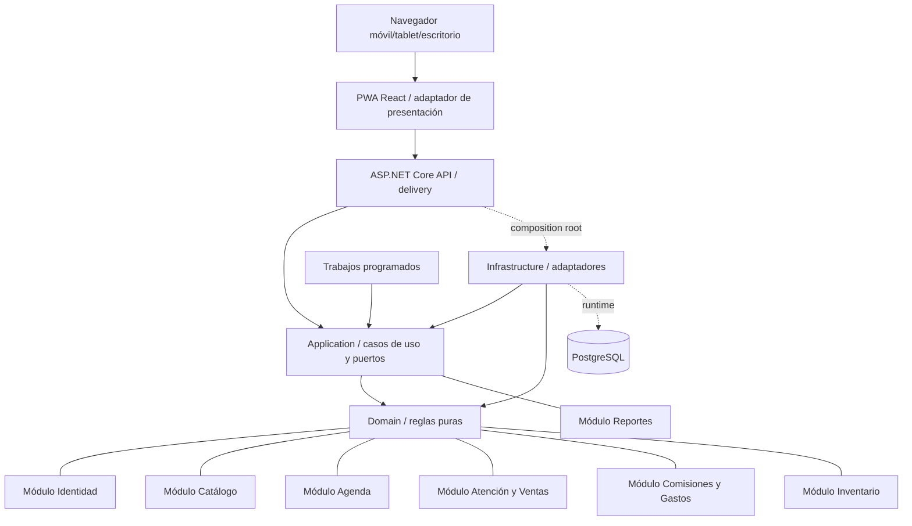
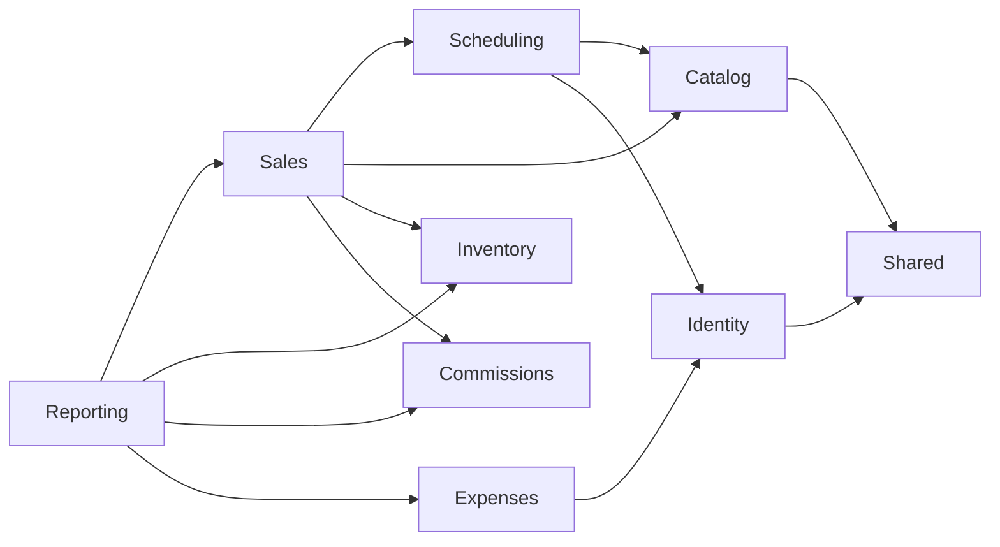

# Arquitectura y decisiones técnicas

## 1. Arquitectura elegida

**Clean Architecture en un monolito modular**, con una PWA separada como adaptador de presentación, una API REST y PostgreSQL como adaptador transaccional. El dominio y los casos de uso no dependen de React, ASP.NET Core, Entity Framework, PostgreSQL, Docker ni proveedores externos.

Los módulos son límites de código y negocio, no servicios desplegados independientemente. La regla de dependencia completa está en [14-clean-architecture-y-solid.md](14-clean-architecture-y-solid.md).

## 2. Stack definido

- Backend: C#, .NET 10 LTS, ASP.NET Core 10 Web API con Controllers delgados y Entity Framework Core 10 como adaptador.
- Frontend: TypeScript, React 19.2, Vite y Workbox como PWA.
- Datos: PostgreSQL 18 mediante Npgsql.
- Pruebas: xUnit, Testcontainers, Vitest, Testing Library y Playwright.
- Operación: Docker/Compose, OpenTelemetry y Sentry.

Las versiones, estrategia PWA, contenedores y CI/CD se detallan en [15-stack-pwa-y-docker.md](15-stack-pwa-y-docker.md). Elegir estas tecnologías no cambia la dirección de dependencias: solo los adaptadores conocen el stack.

## 3. Módulos

| Módulo | Responsabilidad | No debe hacer |
|---|---|---|
| Identity | sesión, usuarios, roles | reglas económicas |
| Catalog | servicios, ofertas, productos | confirmar citas |
| Scheduling | horarios, excepciones, disponibilidad, citas | generar comisiones |
| Sales | atención, detalles, descuentos, pagos | editar reglas históricas |
| Inventory | entradas, salidas, costo promedio | decidir precio de venta |
| Commissions | tasas, entradas, liquidaciones | cobrar al cliente |
| Expenses | categorías y gastos pagados | contabilidad fiscal |
| Reporting | consultas derivadas y exportación | modificar operaciones |
| Audit | registro transversal | guardar secretos |

## 4. Dependencias permitidas

El cierre de venta coordina varios módulos dentro de una transacción de aplicación. No se usan eventos asíncronos para consistencia económica crítica.

## 5. ADRs

### ADR-001 — Monolito modular

**Decisión:** una aplicación y una base.  
**Razón:** equipo y negocio pequeños, transacciones cruzadas importantes y operación de una sucursal.  
**Consecuencia:** despliegue sencillo y consistencia fuerte; se deben respetar límites de módulos para evitar código acoplado.

### ADR-002 — PostgreSQL relacional

**Decisión:** base relacional.  
**Razón:** reservas, pagos, inventario y liquidaciones requieren restricciones, transacciones y reportes.  
**Consecuencia:** migraciones disciplinadas; JSON solo para instantáneas/auditoría, no como modelo principal.

### ADR-003 — Sin microservicios ni cola en MVP

**Decisión:** procesos críticos síncronos.  
**Razón:** menor operación y comportamiento determinista.  
**Consecuencia:** trabajos no críticos como exportaciones o recordatorios futuros pueden añadirse como jobs.

### ADR-004 — Cliente sin cuenta

**Decisión:** token de gestión por cita.  
**Razón:** mínima fricción.  
**Consecuencia:** token debe ser aleatorio, almacenarse con hash, caducar después de la cita y poder rotarse.

### ADR-005 — Aplicación como fuente de agenda

**Decisión:** no aceptar ediciones paralelas en Calendar.  
**Razón:** evitar doble reserva y conflictos.  
**Consecuencia:** la transición requiere fecha de corte y capacitación; una futura integración sería de salida o con reglas explícitas.

### ADR-006 — Historial por instantáneas y ajustes

**Decisión:** guardar nombres/precios/tasas aplicados y no borrar efectos.  
**Razón:** reproducibilidad económica.  
**Consecuencia:** más campos, pero reportes estables y auditoría clara.

### ADR-007 — PWA obligatoria, no app nativa

**Decisión:** la interfaz será una PWA instalable y responsive.  
**Razón:** acceso inmediato, experiencia móvil, una base de código e instalación opcional en teléfonos/tablet.  
**Consecuencia:** el shell y lecturas recientes pueden funcionar offline, pero reservas y escrituras económicas requieren red para conservar consistencia.

### ADR-008 — Clean Architecture y SOLID

**Decisión:** Domain y Application no dependen de frameworks; las tecnologías se implementan como adaptadores.  
**Razón:** preservar reglas y casos de uso ante cambios tecnológicos.  
**Consecuencia:** límites por proyectos, puertos específicos, composition root y pruebas automáticas de arquitectura.

### ADR-009 — Docker como entorno reproducible

**Decisión:** desarrollo, CI y despliegue usan imágenes multi-stage y Compose.  
**Razón:** evitar diferencias de entorno y hacer repetible el arranque.  
**Consecuencia:** imágenes fijadas, ejecución no root, healthchecks y migración controlada.

Las decisiones posteriores se mantienen como archivos individuales:

- [ADR-010 — Web API con Controllers](adr/ADR-010-controller-web-api.md)
- [ADR-011 — Identity con cookie same-origin](adr/ADR-011-identity-cookie-same-origin.md)
- [ADR-012 — Monorepo y Clean Architecture](adr/ADR-012-monorepo-clean-architecture.md)

## 6. Estructura de código sugerida

La estructura concreta del monorepo se define en [15-stack-pwa-y-docker.md](15-stack-pwa-y-docker.md) y los límites internos en [14-clean-architecture-y-solid.md](14-clean-architecture-y-solid.md). Cada módulo mantiene dominio, aplicación, adaptadores y delivery sin duplicar ceremonias innecesarias.

## 7. Manejo de errores

- Errores de validación con campos y mensajes comprensibles.
- Conflictos de concurrencia con código estable (`SLOT_TAKEN`, `OUT_OF_STOCK`, `VERSION_CONFLICT`).
- Errores internos con `request_id`; detalle técnico solo en logs.
- Operaciones idempotentes para cierres y acciones que puedan repetirse por mala conexión.

## 8. Despliegue y entornos

- `local`: base aislada con semillas.
- `staging`: datos ficticios, validación de migraciones y pruebas de aceptación.
- `production`: datos reales, acceso restringido y copias automáticas.

Docker Compose levanta PWA, API y PostgreSQL en desarrollo. Producción usa imágenes inmutables y puede usar PostgreSQL administrado. El pipeline ejecuta lockfiles, análisis estático, pruebas de arquitectura/unidad/integración/E2E, compilación, escaneo, migración validada y despliegue. Las migraciones destructivas requieren estrategia expandir/migrar/contraer y respaldo.

## 9. Observabilidad y recuperación

- Logs estructurados con `request_id`, usuario interno y acción, sin secretos.
- Seguimiento de errores de frontend/backend.
- Métricas: latencia, tasa de error, conflictos de agenda y fallos de cierre.
- Copia diaria de base, retención definida por proveedor y prueba de restauración trimestral.
- Procedimiento manual documentado para operar temporalmente con Calendar/cuaderno si el sistema no está disponible.
