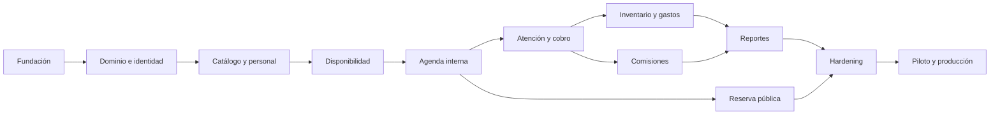

# Resumen del plan de desarrollo

El plan operativo completo está en [17-plan-maestro-fases.md](17-plan-maestro-fases.md). Ese documento es la fuente de verdad para orden, entregables, criterios de aceptación, dependencias y puertas de salida.

## Estrategia

- Avanzar mediante incrementos verticales demostrables.
- Proteger primero arquitectura, dinero, estados y concurrencia.
- Mantener Domain/Application independientes de frameworks.
- Validar cada release con usuarios reales del rol correspondiente.
- No iniciar una fase si su dependencia no superó la puerta anterior.
- No convertir elementos posteriores en bloqueantes del MVP.

## Fases

| Fase | Resultado principal | Puerta/release |
|---:|---|---|
| 0 | Baseline, backlog y plan aprobados | G0 |
| 1 | Repositorio, PWA, API, Docker, CI y staging | G1 / R0 |
| 2 | Núcleo de dominio, puertos, persistencia y pruebas | G2 |
| 3 | Identidad, roles y autorización | G3 |
| 4 | Barberos, servicios, productos, precios y tasas | G4 / R1 |
| 5 | Horarios, excepciones y disponibilidad | G5 |
| 6 | Clientes y agenda interna | G6 / R2 |
| 7 | Atención, servicios, cortesía y cobro | G7 / R3 |
| 8 | Productos, inventario y gastos | G8 / R4 |
| 9 | Comisiones, liquidaciones y reversos | G9 / R5 |
| 10 | Paneles, reportes y auditoría | G10 / R6 |
| 11 | Reserva pública y PWA completa | G11 / R7 |
| 12 | Seguridad, rendimiento y preparación productiva | G12 / RC |
| 13 | Migración, piloto y go-live | G13 / MVP |
| 14 | Estabilización y mejoras basadas en evidencia | Versiones 1.x |

## Camino crítico

## Releases demostrables

- **R0:** esqueleto reproducible y desplegado.
- **R1:** configuración operativa completa.
- **R2:** agenda interna funcional.
- **R3:** jornada de servicios y cobros.
- **R4:** productos, inventario y gastos.
- **R5:** liquidación de barberos trazable.
- **R6:** control y reportes del dueño.
- **R7:** reserva pública e instalación PWA.
- **RC:** candidato seguro, observable y recuperable.
- **MVP:** operación real reconciliada.

## Condición para avanzar

Cada fase requiere:

- entregables existentes;
- criterios de aceptación con evidencia;
- regresión del camino crítico verde;
- migraciones y documentación sincronizadas;
- demostración en staging;
- aprobación de su puerta de salida.

## Próximo paso

Después de aprobar el plan maestro comienza la Fase 1: inicializar repositorio, solución .NET, PWA, Docker/Compose, PostgreSQL, pipeline, pruebas de arquitectura y staging técnico. No se crean todavía todas las tablas o pantallas.

