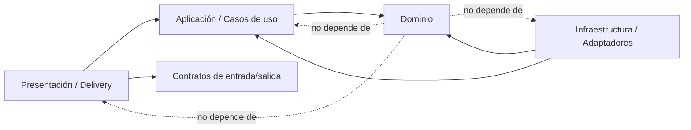

# Clean Architecture, SOLID y límites de dependencia

## 1. Objetivo

La independencia tecnológica se garantiza en el **núcleo**, no fingiendo que toda la aplicación carece de frameworks. React, ASP.NET Core, Entity Framework y PostgreSQL existirán, pero permanecerán en los bordes. Las reglas de Lou Barbershop no importan ni conocen esas tecnologías.

Cambiar React, PostgreSQL o el mecanismo de autenticación debe requerir reemplazar adaptadores y composición, no reescribir entidades, casos de uso ni reglas económicas.

## 2. Regla de dependencia



Solo se depende hacia dentro:

- `Domain` no referencia paquetes de web, ORM, JSON, logging, UI o base de datos.
- `Application` referencia `Domain` y declara puertos; no conoce ASP.NET, EF Core, PostgreSQL, Sentry ni React.
- `Infrastructure` implementa puertos con tecnologías concretas.
- `Api` transforma HTTP a comandos/consultas y compone dependencias.
- `Web` consume contratos HTTP; el backend sigue siendo autoridad de reglas.

## 3. Backend por capas

```text
src/backend/
  LouBarbershop.Domain/
    Appointments/
    Sales/
    Commissions/
    Inventory/
    SharedKernel/
  LouBarbershop.Application/
    Abstractions/
    Appointments/
      CreateAppointment/
    Sales/
      PayOperation/
    Commissions/
      CreateSettlement/
  LouBarbershop.Infrastructure/
    Persistence/
    Identity/
    Observability/
    Time/
  LouBarbershop.Api/
    Endpoints/
    Contracts/
    Middleware/
    Composition/
tests/backend/
  Domain.Tests/
  Application.Tests/
  Architecture.Tests/
  Integration.Tests/
  Api.Tests/
```

### Dominio

Contiene entidades, agregados, value objects, políticas y eventos internos de dominio. Ejemplos:

- `Money`, `CommissionRate`, `TimeRange`, `PhoneNumber`.
- `Appointment`, `SaleOperation`, `CommissionEntry`, `Settlement`.
- reglas de transición, total, cortesía y liquidación.

No contiene atributos de EF, controladores, DTO HTTP ni acceso a archivos.

### Aplicación

Un caso de uso por intención, por ejemplo:

- `CreateAppointment`.
- `RescheduleAppointment`.
- `PaySaleOperation`.
- `CreateSettlement`.
- `ReversePaidOperation`.

Declara puertos pequeños y específicos: `IAppointmentRepository`, `IUnitOfWork`, `IClock`, `IIdGenerator`, `ICurrentActor`, `IInventoryAvailability`, `IAuditWriter`. Orquesta dominio y transacción; no implementa SQL ni HTTP.

### Infraestructura

Implementa puertos:

- repositorios EF Core/PostgreSQL;
- autenticación/cookies;
- reloj del sistema;
- Sentry/OpenTelemetry;
- exportación CSV;
- proveedor futuro de Calendar o mensajería.

### API

Endpoints, autenticación HTTP, validación de formato, serialización, versionado y traducción de errores. Un endpoint no contiene cálculos de comisión, disponibilidad ni inventario.

## 4. Frontend por límites

```text
src/frontend/src/
  core/
    domain/               # Money, rangos, tipos y reglas de presentación puras
    application/          # acciones de UI y puertos
  infrastructure/
    api/                   # cliente REST
    storage/               # preferencias/cache no crítica
    pwa/                   # service worker, actualización, conectividad
  presentation/
    app/
    features/
    components/
    routes/
  composition/
```

El frontend no replica reglas económicas autoritativas. Puede validar por experiencia de usuario, pero el backend siempre recalcula precio, comisión, disponibilidad, total e inventario.

React solo aparece en `presentation` y `composition`. El cliente HTTP implementa puertos del frontend. Cambiar React exige rehacer presentación, no los contratos, tipos puros ni el backend.

## 5. Agregados y transacciones

- `Appointment` protege estado e intervalo lógico; la exclusión concurrente se refuerza en persistencia.
- `SaleOperation` protege detalles, total y transición a pago.
- `Settlement` protege inclusión única y cierre.
- `Inventory` usa movimientos; la coordinación de varias existencias ocurre en el caso de uso de pago.

Los agregados no se hacen gigantes. Las operaciones multiagregado con consistencia inmediata se coordinan en Application usando `IUnitOfWork` y una transacción relacional.

## 6. SOLID aplicado

### S — Responsabilidad única

- `PaySaleOperation` coordina el cierre; no genera HTML ni ejecuta SQL.
- `CommissionPolicy` calcula; `CommissionRepository` persiste.
- Un componente de agenda no administra inventario.

### O — Abierto/cerrado

- Nuevos medios de pago se incorporan mediante tipo/política y adaptador, sin modificar cálculos no relacionados.
- Un futuro adaptador de Google Calendar implementará un puerto de publicación sin entrar al dominio.

No se crean abstracciones especulativas: se extraen cuando hay una frontera real o más de una implementación razonable.

### L — Sustitución de Liskov

- Toda implementación de repositorio debe respetar la misma semántica de no encontrado, concurrencia y transacción.
- Dobles de prueba no pueden aceptar estados que la implementación real rechaza.

### I — Segregación de interfaces

- Preferir `IAppointmentReader` y `IAppointmentWriter` específicos a un `IRepository<T>` con operaciones irrelevantes.
- Un caso de uso recibe solo los puertos que utiliza.

### D — Inversión de dependencias

- Application define los puertos; Infrastructure los implementa.
- El composition root es el único lugar que elige EF Core, reloj, auditoría y autenticación concretos.

## 7. Otras prácticas obligatorias

- Value objects para dinero, tasas e intervalos; evitar obsesión por primitivos.
- Entidades con comportamiento, no modelos anémicos llenos de setters públicos.
- Resultados de dominio explícitos para fallos esperables; excepciones para fallos inesperados.
- Inmutabilidad cuando sea posible.
- Nombres del lenguaje del negocio.
- No usar patrón repositorio genérico como sustituto automático del ORM.
- No exponer entidades del dominio directamente por HTTP.
- No introducir MediatR u otro bus dentro de Application como requisito arquitectónico. Si se usa como adaptador de despacho, los casos de uso siguen siendo invocables sin él.
- No acoplar validación de negocio a atributos del framework.
- Evitar `Service`, `Manager` o `Helper` genéricos sin responsabilidad concreta.

## 8. Pruebas de arquitectura automatizadas

El pipeline debe fallar si:

- Domain referencia Application, Infrastructure, Api, EF Core o ASP.NET Core.
- Application referencia Infrastructure, Api, EF Core o ASP.NET Core.
- endpoints acceden directamente al `DbContext`.
- Infrastructure contiene casos de uso.
- Presentation del frontend se importa desde `core`.
- `core` del frontend importa React, Workbox o el cliente HTTP concreto.

Estas restricciones se verifican con pruebas de arquitectura/reflexión en .NET y reglas de imports/lint en TypeScript.

## 9. Criterio de reemplazabilidad

Una decisión cumple independencia si puede responder:

1. ¿Qué puerto define el núcleo?
2. ¿Qué adaptador contiene la tecnología?
3. ¿Qué pruebas del núcleo funcionan sin esa tecnología?
4. ¿Qué composición se cambia para sustituirla?

Ejemplos:

- PostgreSQL → otra base: reemplazar persistencia y migración; dominio/aplicación intactos.
- React → otra UI: reemplazar frontend de presentación; API y reglas intactas.
- Sentry → otro observador: reemplazar adaptador; casos de uso intactos.
- Google Calendar → otro calendario: reemplazar adaptador futuro; agenda interna intacta.

## 10. Prohibiciones arquitectónicas

- Lógica de comisión en controladores, componentes React o triggers opacos.
- Entidades de dominio heredando clases de framework.
- `DbContext` fuera de Infrastructure/composición autorizada.
- Consultas SQL construidas desde Presentation/Application.
- Dependencias circulares entre módulos.
- Escrituras económicas offline que después “sincronicen” sin control transaccional.
- Usar microservicios para simular desacoplamiento.

