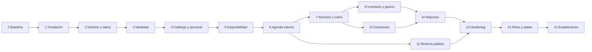

# Plan maestro de desarrollo por fases

**Producto:** Lou Barbershop  
**Alcance:** MVP productivo para una barbería de una sola sucursal  
**Arquitectura:** Clean Architecture, monolito modular, ASP.NET Core Web API y React PWA  
**Propósito:** convertir toda la documentación funcional y técnica en una secuencia ejecutable, verificable y trazable.

---

## 1. Cómo utilizar este plan

Este documento es la fuente principal para ordenar el desarrollo. Los documentos de requisitos, reglas, datos, API, seguridad, UX y pruebas siguen siendo la fuente del contenido específico.

La jerarquía de ejecución es:

```text
Fase → incremento vertical → historia/requisito → tareas → pruebas → entregable → puerta de salida
```

Una fase no se considera terminada porque el código compile. Deben existir entregables demostrables, pruebas y evidencia de los criterios de aceptación. Las fases pueden solaparse únicamente en actividades preparatorias que no dependan de una puerta pendiente; no se debe construir lógica económica sobre fundamentos todavía inestables.

### 1.1 Estimaciones

No se fijan semanas antes de conocer tamaño del equipo, disponibilidad y velocidad. Se usa tamaño relativo:

- **S:** incremento pequeño y acotado.
- **M:** varias historias relacionadas.
- **L:** flujo completo con concurrencia o economía.
- **XL:** estabilización, migración o salida productiva.

Después de dos iteraciones se pueden convertir tamaños en fechas usando velocidad observada, no optimismo.

### 1.2 Estados de fase

- `PENDING`: no iniciada.
- `READY`: entradas y dependencias disponibles.
- `IN_PROGRESS`: trabajo activo.
- `ACCEPTANCE`: implementación completa en validación.
- `DONE`: puerta de salida aprobada.
- `BLOCKED`: impedimento explícito con responsable y acción.

---

## 2. Principios de ejecución

1. **Vertical antes que horizontal:** cada incremento conecta UI, API, caso de uso, dominio, persistencia, permisos, auditoría y pruebas.
2. **Reglas en el núcleo:** Domain/Application no importan ASP.NET Core, EF Core, React, Workbox, PostgreSQL ni Sentry.
3. **Backend autoritativo:** la PWA puede validar para ayudar, pero precio, disponibilidad, comisión, total, permisos e inventario se recalculan en servidor.
4. **Historial inmutable:** correcciones económicas mediante reversos o ajustes.
5. **Consistencia fuerte:** reserva, cobro, inventario y liquidación usan transacciones y control de concurrencia.
6. **PWA segura:** sin escrituras críticas offline.
7. **Una sucursal:** no introducir multitenencia, microservicios, colas, Redis o Kubernetes sin una necesidad demostrada.
8. **Automatización temprana:** formato, arquitectura, pruebas, build y escaneo desde el primer incremento.
9. **Datos mínimos:** solo información necesaria del cliente.
10. **Demostración frecuente:** cada release interno debe poder usarse desde teléfono y tablet.

---

## 3. Gobierno ligero del proyecto

Aunque una persona desempeñe varios papeles, las responsabilidades deben ser claras:

| Responsabilidad | Responsable lógico | Función |
|---|---|---|
| Decisión de negocio | Dueño de Lou Barbershop | Aceptar reglas y prioridades |
| Validación operativa | Administración y barbero representante | Probar flujos reales |
| Decisión técnica | Desarrollador responsable | Mantener arquitectura y calidad |
| Aceptación funcional | Dueño + usuario del flujo | Aprobar entregables demostrados |
| Operación productiva | Dueño + desarrollador | Autorizar migración y salida |

### 3.1 Flujo de cambio

Todo cambio que afecte precio, comisión, cobro, estados, inventario, permisos o alcance debe:

1. describir el problema;
2. identificar reglas, RF, HU, API, datos y pruebas afectados;
3. registrar o actualizar ADR/decisión de negocio;
4. definir compatibilidad histórica y migración;
5. aprobarse antes de implementarse;
6. actualizar trazabilidad y criterios de aceptación.

### 3.2 Estrategia Git

- Rama principal protegida y siempre desplegable.
- Ramas de trabajo cortas por historia o incremento.
- Pull request pequeño con descripción, riesgos, pruebas y capturas cuando haya UI.
- Rebase/merge según convención elegida; evitar ramas de larga duración.
- Versionado semántico desde el primer release interno; imágenes etiquetadas por commit SHA.

---

## 4. Puertas globales de calidad

### Definition of Ready de una historia

- ID y objetivo de usuario.
- Criterios de aceptación observables.
- Reglas de negocio relacionadas.
- rol y permisos definidos;
- estados y errores previstos;
- contrato API y cambio de datos identificados;
- wireframe o comportamiento de UI si aplica;
- pruebas principales descritas;
- dependencias satisfechas;
- sin pregunta de negocio bloqueante.

### Definition of Done de una historia

- Implementación respeta límites de Clean Architecture.
- Pruebas de dominio/aplicación/integración/UI pertinentes pasan.
- Casos positivos, negativos, autorización y concurrencia cubiertos.
- Migración versionada y probada desde base anterior.
- API/OpenAPI y documentación actualizadas.
- Auditoría y observabilidad presentes cuando corresponda.
- Estados de carga, vacío, error, reintento y conectividad resueltos.
- Accesibilidad probada en el flujo.
- Probada en teléfono y tablet cuando hay UI.
- Sin secreto, dato sensible o error técnico expuesto.
- CI verde y revisión aprobada.

### Umbrales del MVP

- Cero defectos críticos o altos sin resolución/aceptación explícita.
- Todos los invariantes económicos tienen pruebas dedicadas.
- Domain/Application mantienen cobertura de ramas suficiente para impedir regresiones; objetivo inicial 85 %, sin sustituir revisión de escenarios.
- Cero violaciones de pruebas de arquitectura.
- Cero fallos serios/críticos de accesibilidad automatizada en flujos principales.
- Cero vulnerabilidades críticas conocidas en imágenes/dependencias; las altas requieren corrección o aceptación documentada.
- Disponibilidad, backups y restauración cumplen RNF antes de producción.

---

## 5. Mapa completo de fases y releases

| Fase | Nombre | Tamaño | Release resultante |
|---|---|---:|---|
| 0 | Baseline y preparación ejecutiva | S | Plan aprobado |
| 1 | Fundación técnica reproducible | L | R0 — Esqueleto desplegable |
| 2 | Núcleo de dominio y persistencia | L | Base de dominio verificable |
| 3 | Identidad, roles y seguridad interna | M | Acceso interno seguro |
| 4 | Personal, catálogo y configuración económica | L | R1 — Maestros operativos |
| 5 | Horarios y motor de disponibilidad | L | Disponibilidad confiable |
| 6 | Clientes y agenda interna | XL | R2 — Agenda operativa |
| 7 | Atención, servicios, ajustes y cobro | XL | R3 — Operación diaria de servicios |
| 8 | Productos, inventario y gastos | L | R4 — Operación comercial completa |
| 9 | Comisiones, liquidaciones y reversos | XL | R5 — Control económico de barberos |
| 10 | Paneles, reportes y auditoría | L | R6 — Gestión del dueño |
| 11 | Reserva pública y madurez PWA | L | R7 — Experiencia del cliente |
| 12 | Hardening y preparación productiva | XL | Release Candidate |
| 13 | Migración, piloto y salida | XL | MVP productivo |
| 14 | Estabilización y mejora posterior | Continuo | Versiones 1.x |



---

## 6. Fase 0 — Baseline y preparación ejecutiva

**Objetivo:** congelar una línea base coherente para que el código no empiece sobre decisiones implícitas.  
**Dependencias:** documentación 01–16.  
**Alcance:** planificación y preparación; no implementación funcional.  
**Estado:** `DONE`; G0 aprobada. Evidencia en [22-acta-fase-0-g0.md](22-acta-fase-0-g0.md).

### Actividades

- Revisar y aprobar alcance incluido/excluido.
- Confirmar stack: .NET 10, Controllers, EF Core, PostgreSQL, React/Vite PWA y Docker.
- Registrar Controllers como modelo de API y sesión con cookies `HttpOnly`/Identity como decisión técnica.
- Inventariar 46 RF, 18 RNF, 28 HU, 18 CU, 53 RN y 9 ADR.
- Asignar cada historia a una fase y a pruebas.
- Preparar tablero con épicas/fases, prioridad, dependencia y estado.
- Definir convención de nombres, ramas, commits y revisión.
- Definir responsables lógicos de aceptación.
- Identificar datos ficticios iniciales; no usar precios de ejemplo como reales.
- Elaborar wireframes de seis flujos críticos descritos en UX.

### Entregables

- **ENT-00-01:** plan maestro aprobado.
- **ENT-00-02:** backlog importable/operable con HU y criterios.
- **ENT-00-03:** ADR de modelo de API, autenticación y estructura del monorepo.
- **ENT-00-04:** mapa de releases y responsables de aceptación.
- **ENT-00-05:** wireframes de cita, agenda, atención, cobro, liquidación y reserva pública.

### Criterios de aceptación

- **AC-00-01:** todo RF/HU tiene fase; no queda requisito “sin dueño”.
- **AC-00-02:** cada fase declara entradas, entregables y puerta de salida.
- **AC-00-03:** no existe contradicción activa entre arquitectura, stack y plan.
- **AC-00-04:** los elementos fuera del MVP están identificados y no aparecen como tareas obligatorias.
- **AC-00-05:** dueño reconoce los seis flujos principales representados.

### Puerta de salida G0

Plan, alcance y decisiones técnicas aprobados. Cualquier cambio posterior sigue control de cambio.

---

## 7. Fase 1 — Fundación técnica reproducible

**Objetivo:** disponer de un repositorio que compile, pruebe, se ejecute con Docker y se despliegue sin lógica de negocio falsa.  
**Dependencias:** G0.  
**Tamaño:** L.  
**Estado:** `ACCEPTANCE`; implementación local verificada, G1 aún no aprobada por CI/staging e instalación manual. Evidencia en [24-evidencia-fase-1-g1.md](24-evidencia-fase-1-g1.md).

### Backend

- Crear `global.json` para .NET 10 y solución.
- Proyectos `Domain`, `Application`, `Infrastructure`, `Api` y proyectos de prueba.
- Configurar referencias únicamente hacia dentro.
- `WebApplicationBuilder`, Controllers, `ProblemDetails`, OpenAPI, health checks, compresión, timeouts y rate limiting base.
- `Program.cs` como composition root legible; registros por extensiones de módulo.
- Configuración tipada y validada al iniciar.
- Correlation/request ID y logging estructurado sin datos personales.
- Endpoints separados `/health/live` y `/health/ready`.

### Frontend/PWA

- Crear React + TypeScript estricto + Vite.
- Capas `core`, `infrastructure`, `presentation`, `composition` y reglas de imports.
- Enrutamiento, layout responsive y boundary de errores.
- Manifest PWA, iconos temporales, service worker y detección online/offline.
- TanStack Query, formularios y cliente API base sin reglas de negocio duplicadas.
- Storybook y base de tokens visuales.

### Datos y Docker

- PostgreSQL 18 en Compose con volumen y healthcheck.
- `api.Dockerfile` y `web.Dockerfile` multi-stage, imágenes fijadas y usuario no root.
- `compose.yaml`, `compose.dev.yaml`, `.dockerignore` y `.env.example`.
- Conexión EF/Npgsql solo desde Infrastructure.
- Primera migración técnica y job controlado de migraciones.

### Calidad y CI

- `.editorconfig`, nullable, analyzers y warnings como errores.
- ESLint, Prettier, accesibilidad y límites de imports.
- xUnit/Vitest/Testing Library configurados.
- Pruebas de arquitectura iniciales.
- Pipeline: restore, format/lint, test, build PWA/API, imágenes y escaneo.
- Entornos local y staging documentados.

### Entregables

- **ENT-01-01:** monorepo compilable.
- **ENT-01-02:** Compose funcional desde clon limpio.
- **ENT-01-03:** PWA instalable con shell y estado de conexión.
- **ENT-01-04:** API con OpenAPI, ProblemDetails y health checks.
- **ENT-01-05:** CI verde y staging técnico.
- **ENT-01-06:** guía de desarrollo local y gestión de secretos.

### Criterios de aceptación

- **AC-01-01:** `docker compose up --build` inicia DB, API y web sin pasos ocultos.
- **AC-01-02:** readiness falla si DB no está disponible; liveness continúa reflejando proceso vivo.
- **AC-01-03:** Domain/Application no referencian frameworks; prueba automática lo demuestra.
- **AC-01-04:** PWA se instala y abre; una mutación simulada offline se bloquea claramente.
- **AC-01-05:** imágenes runtime ejecutan sin root y no contienen SDK ni secretos.
- **AC-01-06:** CI parte de cero y reproduce build/pruebas.
- **AC-01-07:** errores API usan formato consistente y `requestId`.

### Puerta de salida G1 — R0

Repositorio reproducible y desplegado en staging. No avanzar si la arquitectura solo existe en documentos pero las referencias permiten violarla.

---

## 8. Fase 2 — Núcleo de dominio y persistencia

**Objetivo:** implementar los tipos, políticas e infraestructura mínima que protegerán agenda y economía.  
**Dependencias:** G1.  
**Tamaño:** L.

### Dominio/Application

- Value objects: `Money`, `CommissionRate`, `TimeRange`, `PhoneNumber`, identificadores y cantidades.
- Convenciones de moneda BOB, centavos, puntos base y redondeo half-up.
- Resultados/errores esperables sin excepciones como control de flujo.
- Abstracciones `IClock`, `IIdGenerator`, `ICurrentActor`, `IUnitOfWork` y puertos específicos.
- Estados y transiciones base de cita, operación, comisión y liquidación.
- Políticas de solapamiento, totales, descuento/cortesía, costo promedio y comisión.
- Eventos de dominio solo para cohesión interna; no introducir bus distribuido.

### Persistencia

- `AppDbContext` y configuraciones en Infrastructure.
- Estrategia UUID, UTC, concurrencia optimista y eliminación lógica.
- Esquema incremental conforme al modelo de datos, sin crear tablas prematuramente no usadas por el primer slice.
- Restricciones para dinero no negativo, vigencias y unicidad.
- Infraestructura de auditoría y migraciones.
- Utilidades de transacción e idempotencia.

### Pruebas

- Pruebas paramétricas de dinero, tasas y redondeo.
- Pruebas de todas las transiciones permitidas/prohibidas.
- Pruebas de rangos adyacentes y solapados.
- Pruebas de costo promedio y comisiones normales/cortesía.
- Integración de migración sobre PostgreSQL real con Testcontainers.

### Entregables

- **ENT-02-01:** Shared Kernel y políticas de dominio puras.
- **ENT-02-02:** puertos Application y adaptadores técnicos base.
- **ENT-02-03:** estrategia de migraciones/concurrencia/auditoría.
- **ENT-02-04:** suite de invariantes críticos.
- **ENT-02-05:** diccionario de errores de dominio → ProblemDetails.

### Criterios de aceptación

- **AC-02-01:** cálculos no usan `double`/`float` para dinero.
- **AC-02-02:** una tasa histórica se representa sin depender de configuración actual.
- **AC-02-03:** todas las transiciones inválidas fallan sin persistir cambios parciales.
- **AC-02-04:** pruebas ejecutan dominio sin host web ni base.
- **AC-02-05:** migraciones suben una base vacía y una base de versión anterior.
- **AC-02-06:** infraestructura puede reemplazarse por dobles sin modificar casos de uso.

### Puerta de salida G2

Invariantes fundamentales verdes y modelo técnico capaz de soportar slices sin filtrar EF/ASP.NET al núcleo.

---

## 9. Fase 3 — Identidad, roles y seguridad interna

**Objetivo:** acceso seguro para dueño, administración y barberos, con autorización del lado servidor.  
**Dependencias:** G2.  
**Cobertura:** RF-001–003, CU-01, HU-001 y base de HU-002.  
**Tamaño:** M.

### Trabajo

- Integrar ASP.NET Core Identity exclusivamente en Infrastructure/Api.
- Inicio/cierre de sesión con cookie `HttpOnly`, `Secure`, `SameSite` apropiado y antiforgery.
- Perfiles internos separados de identidad técnica.
- Roles múltiples `OWNER`, `ADMIN`, `BARBER` y políticas por capacidad.
- Usuario dueño inicial mediante seed/proceso seguro, sin contraseña en repositorio.
- Desactivación y revocación de sesiones.
- Páginas PWA de acceso, sesión expirada y acceso denegado.
- Matriz de permisos implementada y probada positiva/negativamente.
- Persistencia de Data Protection keys conforme al despliegue.
- Rate limiting de login y logs de eventos sin credenciales.

### Entregables

- **ENT-03-01:** autenticación interna completa.
- **ENT-03-02:** autorización por políticas/capacidad.
- **ENT-03-03:** administración básica de usuarios por dueño.
- **ENT-03-04:** matriz automatizada de permisos.
- **ENT-03-05:** procedimiento de alta, baja y recuperación administrada.

### Criterios de aceptación

- **AC-03-01:** usuario inactivo o credenciales inválidas no acceden ni revelan existencia.
- **AC-03-02:** barbero no puede leer/modificar recursos ajenos mediante URL/API directa.
- **AC-03-03:** dueño conserva simultáneamente roles propietario y barbero.
- **AC-03-04:** autenticación precede autorización en pipeline.
- **AC-03-05:** ninguna contraseña/token aparece en logs, bundle, variables versionadas o auditoría.
- **AC-03-06:** antiforgery y cookies funcionan desde la PWA detrás del proxy de staging.

### Puerta de salida G3

Todos los siguientes módulos pueden confiar en `ICurrentActor` y políticas probadas; no se acepta autorización solo visual.

---

## 10. Fase 4 — Personal, catálogo y configuración económica

**Objetivo:** configurar quién trabaja, qué ofrece, duración, precio, productos y tasas históricas.  
**Dependencias:** G3.  
**Cobertura:** RF-002–014, RF-046, RF-005; CU-02; HU-002, HU-003, HU-040.  
**Tamaño:** L.

### Incrementos

1. Perfiles de barbero y tipo dueño/contratado.
2. Servicios con precio/duración de referencia.
3. Oferta por barbero con vigencia y sobrescritura.
4. Productos, marca, SKU opcional, precio y stock mínimo.
5. Condiciones de comisión SERVICE/PRODUCT con puntos base y vigencia.
6. Categorías de gasto iniciales.

### UX/API/datos

- Pantallas móviles de listado, alta, edición y desactivación.
- API con DTOs separados, control de versión y validación.
- Desactivación lógica; historial intacto.
- Advertencias de vigencias solapadas y cambios que afectan reservas futuras.
- Auditoría de precio, oferta, tasa y activación.
- Datos de demostración ficticios claramente identificados.

### Entregables

- **ENT-04-01:** gestión de personal/barberos.
- **ENT-04-02:** catálogo de servicios y ofertas.
- **ENT-04-03:** catálogo de productos.
- **ENT-04-04:** reglas de comisión versionadas.
- **ENT-04-05:** categorías de gasto.
- **ENT-04-06:** OpenAPI y pruebas de catálogos.

### Criterios de aceptación

- **AC-04-01:** oferta específica prevalece sobre referencia sin modificar el servicio base.
- **AC-04-02:** desactivar conserva citas/operaciones históricas.
- **AC-04-03:** períodos de comisión del mismo tipo no se solapan.
- **AC-04-04:** solo contratado admite comisión; dueño conserva producción sin deuda.
- **AC-04-05:** editar precio/tasa hoy no altera instantáneas pasadas.
- **AC-04-06:** solo dueño modifica precios y comisiones.
- **AC-04-07:** UI resuelve carga, vacío, validación y desactivación en teléfono/tablet.

### Puerta de salida G4 — R1

Dueño puede configurar los maestros necesarios y reproducir qué condición está vigente en una fecha.

---

## 11. Fase 5 — Horarios y motor de disponibilidad

**Objetivo:** responder de forma confiable cuándo puede atender cada barbero considerando duración.  
**Dependencias:** G4.  
**Cobertura:** RF-004, RF-012, RF-021; CU-03–04; HU-004, HU-011; RN-AGEN-01–05.  
**Tamaño:** L.

### Trabajo

- Horarios semanales con varios intervalos no solapados.
- Vigencia de horarios.
- Excepciones `UNAVAILABLE` y `AVAILABLE_OVERRIDE`.
- Motor puro de disponibilidad con zona `America/La_Paz`.
- Incremento visible de 15 minutos, ocupación por intervalo real.
- Búsqueda por servicio, barbero/cualquiera y rango acotado.
- Precio/duración devueltos por alternativa.
- Endpoints y UI de administración de horarios.
- Cache solo derivable; invalidación ante cambios de oferta/horario/cita.
- Pruebas DST/UTC aunque Bolivia no cambie horario, límites de día, adyacencia y duración insuficiente.

### Entregables

- **ENT-05-01:** horarios y excepciones.
- **ENT-05-02:** motor de disponibilidad puro.
- **ENT-05-03:** endpoint `/availability` y pantalla de consulta.
- **ENT-05-04:** suite de intervalos y rendimiento.

### Criterios de aceptación

- **AC-05-01:** nunca ofrece fuera del turno o dentro de ausencia/bloqueo.
- **AC-05-02:** dos citas adyacentes son válidas; solapadas no.
- **AC-05-03:** un hueco menor a la duración no se ofrece.
- **AC-05-04:** “cualquiera” devuelve alternativas con barbero concreto.
- **AC-05-05:** horarios pasados no aparecen.
- **AC-05-06:** consulta responde en menos de 3 s en volumen objetivo.
- **AC-05-07:** cambiar horario no cancela citas; lista conflictos existentes.

### Puerta de salida G5

El motor pasa matriz exhaustiva de intervalos y puede ser usado por agenda interna sin lógica temporal en UI/controladores.

---

## 12. Fase 6 — Clientes y agenda interna

**Objetivo:** reemplazar operativamente la edición de Google Calendar para reservas internas.  
**Dependencias:** G5.  
**Cobertura:** RF-020–027, CU-05–08, CU-15; HU-010–015; RN-AGEN completa.  
**Tamaño:** XL.

### Incrementos

1. Buscar/crear/corregir cliente con nombre y teléfono normalizado.
2. Crear cita interna confirmada.
3. Agenda diaria móvil y semanal en tablet.
4. Reprogramar, reasignar y cambiar servicio.
5. Cancelar, inasistencia, llegada y comienzo de atención.
6. Historial `AppointmentEvent` con antes/después.
7. Control concurrente de doble reserva en servicio y DB.

### Reglas críticas

- Revalidar disponibilidad dentro de transacción al confirmar.
- Congelar precio y duración informados.
- Una cita: una persona, un servicio principal y barbero concreto.
- Cancelación/no-show no crean ingreso/comisión.
- Barbero no cancela unilateralmente.
- Teléfono compartido permitido; duplicado advertido, no bloqueado.

### Entregables

- **ENT-06-01:** clientes mínimos y búsqueda.
- **ENT-06-02:** agenda interna completa.
- **ENT-06-03:** cambios/cancelación/no-show/llegada auditados.
- **ENT-06-04:** protección transaccional contra doble reserva.
- **ENT-06-05:** vista `Mi día` para barbero.
- **ENT-06-06:** guía de transición desde Google Calendar preparada, aún no ejecutada.

### Criterios de aceptación

- **AC-06-01:** dos solicitudes concurrentes al mismo horario producen una cita y un `SLOT_TAKEN`.
- **AC-06-02:** administración registra una cita habitual en menos de un minuto en prueba de usabilidad.
- **AC-06-03:** reprogramación guarda condición anterior/nueva y actor.
- **AC-06-04:** barbero solo ve agenda propia y no cancela.
- **AC-06-05:** cancelar/no-show libera disponibilidad y no genera operación.
- **AC-06-06:** precio/duración históricos no cambian al editar catálogo.
- **AC-06-07:** agenda usable en teléfono y tablet, con estados accesibles sin depender del color.
- **AC-06-08:** todos los casos T-001–004 pasan.

### Puerta de salida G6 — R2

Administración y un barbero completan un día simulado de agenda sin usar Calendar para editar. Calendar aún puede conservarse como referencia hasta el piloto.

---

## 13. Fase 7 — Atención, servicios, ajustes y cobro

**Objetivo:** registrar lo ocurrido realmente y cerrar servicios pagados o de cortesía con consistencia económica.  
**Dependencias:** G6.  
**Cobertura:** RF-030–037 sin productos definitivos; CU-09–11; HU-020, HU-021, HU-023, HU-024; RN-ATE y RN-PAG.  
**Tamaño:** XL.

### Incrementos

1. Atención desde cita con servicio precargado.
2. Llegada directa `WALK_IN` sin cita ficticia.
3. Añadir/quitar servicios antes de cobrar.
4. Descuento y cortesía con permiso/motivo.
5. Estado `DRAFT → READY_TO_PAY → PAID`.
6. Pago CASH, QR o mixto.
7. Cierre atómico, control de versión e idempotencia.
8. Completar cita vinculada sin confundir planificación y ejecución.

### Reglas críticas

- El servidor obtiene precios/tasas; no confía en totales enviados.
- Total neto no negativo.
- Pagos suman exactamente el total; total cero no crea pago.
- Cortesía conserva servicio y valor de referencia.
- Una operación pagada no se edita.
- Doble toque/reintento con misma clave no duplica cobro.

### Entregables

- **ENT-07-01:** atención reservada/directa.
- **ENT-07-02:** detalles de servicio reales.
- **ENT-07-03:** descuentos/cortesías autorizados.
- **ENT-07-04:** cobro simple/mixto idempotente.
- **ENT-07-05:** panel operativo preliminar del día.
- **ENT-07-06:** recibo/resumen interno.

### Criterios de aceptación

- **AC-07-01:** servicio real distinto al reservado determina cobro y producción.
- **AC-07-02:** cortesía total queda realizada con pago cero.
- **AC-07-03:** 30 Bs efectivo + 40 Bs QR cierra exactamente 70 Bs.
- **AC-07-04:** falta/sobra bloquea cierre sin efectos parciales.
- **AC-07-05:** repetición idempotente crea una sola operación/pagos.
- **AC-07-06:** fallo a mitad de transacción no deja cita completada ni pago parcial.
- **AC-07-07:** barbero solo modifica/cobra operación propia; dueño/admin según matriz.
- **AC-07-08:** escenarios T-003–008 y T-015 pasan.

### Puerta de salida G7 — R3

Una jornada simulada solo con servicios cuadra atenciones, totales y medios de pago desde el detalle hasta el resumen.

---

## 14. Fase 8 — Productos, inventario y gastos

**Objetivo:** completar operación comercial y control de salidas sin duplicar costo de inventario y gasto.  
**Dependencias:** G7.  
**Cobertura:** RF-013–014, RF-032, RF-040–046; CU-12–13; HU-022, HU-030–032; RN-INV y RN-GAS.  
**Tamaño:** L.

### Incrementos

1. Recepción pagada con varios productos, costo y medio.
2. Costo promedio ponderado y movimiento por detalle.
3. Añadir productos a atención y venta independiente.
4. Salida atómica al pagar; costo histórico congelado.
5. Ajuste por conteo, daño, pérdida y consumo interno.
6. Existencia y alerta mínima.
7. Gasto operativo pagado y anulación auditada.
8. Resumen de flujo de caja preliminar separado de resultado.

### Entregables

- **ENT-08-01:** recepciones e historial.
- **ENT-08-02:** movimientos/existencia/costo promedio.
- **ENT-08-03:** venta de productos integrada al cobro.
- **ENT-08-04:** ajustes de inventario.
- **ENT-08-05:** gastos y categorías.
- **ENT-08-06:** reporte de existencias y alerta mínima.

### Criterios de aceptación

- **AC-08-01:** total de recepción coincide con detalles y aumenta existencia.
- **AC-08-02:** compra de mercadería afecta caja pero no duplica gasto operativo/COGS.
- **AC-08-03:** dos ventas concurrentes de última unidad producen una venta y `OUT_OF_STOCK`.
- **AC-08-04:** reverso/ajuste deja movimientos explicables, no sobrescribe cantidad.
- **AC-08-05:** producto inactivo conserva historial y no se vende nuevamente.
- **AC-08-06:** gasto exige fecha, categoría, concepto, importe y medio.
- **AC-08-07:** escenarios T-009 y T-017 pasan.

### Puerta de salida G8 — R4

Conteo inicial + recepciones − ventas ± ajustes coincide con existencia visible, y el flujo distingue inventario de gasto.

---

## 15. Fase 9 — Comisiones, liquidaciones y reversos

**Objetivo:** separar deuda generada al barbero del cobro y pagarla sin duplicidad.  
**Dependencias:** G7 para servicios y G8 para productos.  
**Cobertura:** RF-050–055, RF-037; CU-14, CU-16, CU-18; HU-025, HU-041–043; RN-COM.  
**Tamaño:** XL.

### Incrementos

1. Generación automática al cerrar operación.
2. Base neta y tasa histórica por detalle.
3. Cortesía de servicio contratado sobre referencia.
4. Dueño sin entrada de comisión.
5. Consulta propia por barbero y estado.
6. Borrador de liquidación por fecha de corte.
7. Ajustes con signo, motivo y autorización.
8. Cierre y pago completo atómicos.
9. Reverso antes de liquidar y ajuste negativo después de pagar.

### Entregables

- **ENT-09-01:** ledger de comisiones trazable.
- **ENT-09-02:** vista de comisión propia.
- **ENT-09-03:** creación/revisión/cierre/pago de liquidación.
- **ENT-09-04:** reversos y ajustes posteriores.
- **ENT-09-05:** comprobante interno de liquidación.

### Criterios de aceptación

- **AC-09-01:** cada comisión apunta a detalle, base, tasa, fecha y barbero.
- **AC-09-02:** servicio del dueño produce cero comisión.
- **AC-09-03:** cortesía de contratado paga comisión según D-10.
- **AC-09-04:** cambiar tasa a mitad del período no recalcula pasado.
- **AC-09-05:** una comisión no entra en dos liquidaciones aun con concurrencia.
- **AC-09-06:** liquidación pagada es inmutable.
- **AC-09-07:** reverso pagado crea ajuste futuro sin borrar original.
- **AC-09-08:** escenarios T-007–013 pasan y total se reproduce al centavo.

### Puerta de salida G9 — R5

El dueño liquida un período de prueba y el barbero puede reconciliar cada centavo con sus operaciones.

---

## 16. Fase 10 — Paneles, reportes y auditoría

**Objetivo:** ofrecer información útil y reconciliable sin inventar contabilidad fiscal.  
**Dependencias:** G8 y G9.  
**Cobertura:** RF-060–066, RF-065; CU-17; HU-050–053; RN-REP.  
**Tamaño:** L.

### Incrementos

1. Panel del día: citas, estados, atenciones y cobros CASH/QR.
2. Servicios/productos por período y ticket promedio.
3. Comisiones generadas, disponibles, liquidadas y pagadas.
4. Gastos por categoría.
5. Resultado operativo aproximado.
6. Flujo de caja separado.
7. Producción/ocupación por barbero, incluido dueño.
8. Auditoría consultable por dueño.
9. Exportación CSV P2, después de reconciliar vistas.

### Entregables

- **ENT-10-01:** panel diario.
- **ENT-10-02:** reportes económicos/operativos.
- **ENT-10-03:** producción y ocupación.
- **ENT-10-04:** explorador de auditoría.
- **ENT-10-05:** exportación CSV segura.
- **ENT-10-06:** diccionario de métricas y fórmulas.

### Criterios de aceptación

- **AC-10-01:** cada total permite navegar o exportar su detalle fuente.
- **AC-10-02:** cobros, ingresos operativos, comisiones generadas/pagadas y gastos no se mezclan.
- **AC-10-03:** compra de inventario no duplica COGS.
- **AC-10-04:** producción del dueño aparece sin deuda de comisión.
- **AC-10-05:** filtros de fecha usan America/La_Paz y bordes correctos.
- **AC-10-06:** CSV respeta permisos, UTF-8 y neutraliza fórmulas peligrosas.
- **AC-10-07:** reportes comunes cumplen objetivo de rendimiento y reproducen dataset controlado.

### Puerta de salida G10 — R6

El dueño reconcilia un período de prueba desde operaciones individuales hasta panel, caja, comisión, inventario y resultado.

---

## 17. Fase 11 — Reserva pública y madurez PWA

**Objetivo:** permitir al cliente reservar sin cuenta manteniendo disponibilidad, privacidad y simplicidad.  
**Dependencias:** G6 estable y G10 para observación; se libera después de operación interna confiable.  
**Cobertura:** RF-028 y rutas públicas; CU-04–07 público; HU-016; RNF-014–015.  
**Tamaño:** L.

### Incrementos

1. Flujo público servicio → barbero/cualquiera → horario → datos → confirmación.
2. Nombre y teléfono normalizados, advertencia de uso de datos.
3. Token de gestión aleatorio, hash, caducidad y rotación.
4. Consultar, reprogramar dentro de reglas y cancelar con enlace.
5. Rate limiting y respuestas no enumerables.
6. Manifest final, iconos, shortcuts e instalación.
7. Estrategia cache y actualización controlada.
8. Pantallas offline/desactualizadas y recuperación de conexión.
9. Medición de abandono sin rastreo invasivo, si se aprueba.

### Entregables

- **ENT-11-01:** reserva pública sin cuenta.
- **ENT-11-02:** gestión segura por token.
- **ENT-11-03:** PWA instalable final.
- **ENT-11-04:** experiencia offline de solo lectura.
- **ENT-11-05:** política de caché/actualización y pruebas.

### Criterios de aceptación

- **AC-11-01:** reserva requiere solo servicio, preferencia, horario, nombre y teléfono.
- **AC-11-02:** revalidación concurrente evita doble reserva.
- **AC-11-03:** teléfono no autoriza acceso; token en claro no se guarda ni registra.
- **AC-11-04:** cliente no puede enumerar citas/clientes.
- **AC-11-05:** sin conexión no se confirma reserva ni mutación crítica.
- **AC-11-06:** nueva versión no interrumpe un formulario/cobro activo.
- **AC-11-07:** flujo principal cumple accesibilidad y se completa cómodamente en teléfono.
- **AC-11-08:** Lighthouse/validación equivalente confirma instalabilidad.

### Puerta de salida G11 — R7

Usuarios de prueba completan reserva y gestión sin explicación; pruebas de abuso, concurrencia, conectividad y actualización pasan.

---

## 18. Fase 12 — Hardening y preparación productiva

**Objetivo:** convertir releases funcionales en un candidato seguro, observable, recuperable y operable.  
**Dependencias:** G10 y G11.  
**Cobertura:** RNF-001–018, seguridad, operación y estrategia de pruebas completa.  
**Tamaño:** XL.

### Seguridad

- Revisión de superficie, permisos y accesos cruzados.
- Threat model basado en repositorio y mitigaciones verificadas.
- Cookies, antiforgery, CSP, HSTS, forwarded headers, CORS y rate limits.
- Escaneo SAST/dependencias/imágenes y SBOM.
- Gestión de secretos y Data Protection keys.
- Redacción de logs y minimización de datos.

### Calidad/rendimiento

- Suite E2E completa T-001–018.
- Pruebas de concurrencia, idempotencia y fallos transaccionales.
- Volumen objetivo: 100.000 operaciones/5 años y 10 barberos como margen.
- Índices/consultas medidos; no optimización especulativa.
- Accesibilidad automática y manual.
- Compatibilidad en navegadores/teléfonos/tablet objetivo.

### Operación

- Staging equivalente a producción.
- Logs, métricas, trazas y Sentry sin acoplar núcleo.
- Alertas de errores, salud, latencia y fallos de jobs/migración.
- Backup diario y restauración ensayada.
- Runbooks: caída, rollback, migración, usuario bloqueado, DB sin conexión y recuperación.
- Migraciones expandir/migrar/contraer y despliegue compatible PWA/API.
- Revisión de términos/privacidad/retención antes de datos reales.

### Entregables

- **ENT-12-01:** informe de hardening y threat model.
- **ENT-12-02:** evidencia completa de pruebas.
- **ENT-12-03:** benchmark y correcciones.
- **ENT-12-04:** backups/restauración verificados.
- **ENT-12-05:** dashboards/alertas y runbooks.
- **ENT-12-06:** release candidate firmado por SHA.

### Criterios de aceptación

- **AC-12-01:** todos los RNF tienen evidencia.
- **AC-12-02:** cero defectos críticos/altos abiertos sin aceptación documentada.
- **AC-12-03:** permisos negativos pasan para cada rol/ruta sensible.
- **AC-12-04:** restauración recupera base consistente en entorno aislado.
- **AC-12-05:** objetivos <2 s operativos, <3 s disponibilidad y <5 s reportes se cumplen en entorno representativo.
- **AC-12-06:** build reproducible, imágenes no root y sin secretos.
- **AC-12-07:** procedure de rollback fue ensayado.
- **AC-12-08:** dueño/admin/barbero completan seis escenarios UX sin ayuda del desarrollador.

### Puerta de salida G12 — Release Candidate

Checklist de producción firmado por responsable técnico y dueño. Sin esta puerta no se cargan datos reales definitivos.

---

## 19. Fase 13 — Migración, piloto y salida productiva

**Objetivo:** cambiar de herramientas actuales a la aplicación sin perder agenda, dinero ni capacidad de operar.  
**Dependencias:** G12.  
**Tamaño:** XL.

### Preparación de datos

- Inventariar usuarios, barberos, servicios, precios, tasas y horarios reales.
- Contar existencias el día de corte.
- Exportar/transcribir citas futuras de Google Calendar.
- Registrar saldos iniciales de comisión sin inventar operaciones cuando no exista detalle.
- Configurar categorías y medios.
- Ejecutar al menos dos migraciones de ensayo con validación.
- Conservar archivo de Calendar/cuaderno; no migrar chats de WhatsApp.

### Capacitación

- Dueño: configuración, reportes, reversos y liquidaciones.
- Administración: agenda, clientes, atención, cobro y contingencias.
- Barberos: Mi día, atención, venta y comisión propia.
- Guías breves y escenarios, no manuales extensos.

### Piloto controlado

1. Elegir fecha/hora de corte y responsables.
2. Backup final y carga de datos.
3. Operar 3–5 días con revisión diaria.
4. Calendar queda solo como referencia; no dos fuentes editables.
5. Reconciliar cada día citas, efectivo, QR, inventario y comisiones.
6. Clasificar incidencias y corregir sin romper historial.
7. Obtener aceptación de cada rol.

### Go-live

- Declarar aplicación fuente oficial.
- Confirmar dominio/TLS, backups, alertas y soporte.
- Publicar reserva pública solo si agenda interna es estable.
- Congelar cambios no críticos durante ventana inicial.
- Monitorizar salud, errores y tiempos de respuesta.

### Entregables

- **ENT-13-01:** scripts/plantillas y reporte de migración.
- **ENT-13-02:** datos iniciales reconciliados y firmados.
- **ENT-13-03:** materiales y evidencia de capacitación.
- **ENT-13-04:** registro de piloto e incidencias resueltas.
- **ENT-13-05:** checklist de go-live y plan de rollback.
- **ENT-13-06:** MVP productivo y aceptación por rol.

### Criterios de aceptación

- **AC-13-01:** todas las citas futuras seleccionadas coinciden con fuente de corte.
- **AC-13-02:** conteo físico coincide con existencia inicial.
- **AC-13-03:** tasas/precios reales fueron revisados por dueño.
- **AC-13-04:** saldo inicial de comisión está separado de operaciones nuevas.
- **AC-13-05:** durante piloto, diferencias diarias se explican/corrigen antes del siguiente cierre.
- **AC-13-06:** cada rol completa sus tareas principales sin asistencia técnica continua.
- **AC-13-07:** rollback puede restaurar operación/manual y datos si falla el corte.
- **AC-13-08:** dueño aprueba la aplicación como fuente oficial.

### Puerta de salida G13 — MVP productivo

Operación real estable, datos reconciliados, usuarios capacitados y soporte/recuperación activos.

---

## 20. Fase 14 — Estabilización y mejora posterior

**Objetivo:** corregir aprendizaje real y priorizar mejoras por evidencia.  
**Dependencias:** G13.  
**Tamaño:** continuo.

### Primer ciclo de estabilización

- Revisión diaria de errores la primera semana y luego semanal.
- Corregir primero pérdida de datos, dinero, permisos, bloqueo operativo y fricción frecuente.
- Medir tiempo de reserva, cierre de atención, diferencias de liquidación e incidencias.
- Revisar capacidad, consultas lentas, backups y alertas.
- Retrospectiva con dueño, administración y barberos.

### Candidatos posteriores, no compromisos automáticos

- Recordatorios/WhatsApp.
- Google Calendar de solo salida.
- CSV ampliado y análisis adicional.
- Propinas, anticipos o pagos parciales.
- Proveedores/compras completas.
- Fidelización y promociones.
- Lista de espera.

Solo ingresan si tienen problema, frecuencia, valor, criterio de aceptación y costo de operación identificados.

### Criterios de aceptación del cierre de estabilización

- No quedan defectos críticos del lanzamiento.
- Métricas y alertas son accionables.
- Restauración sigue verificada.
- Backlog posterior está ordenado por valor/riesgo, no por novedad técnica.
- Se publica retrospectiva y versión estable 1.x.

---

## 21. Plan de releases y demostraciones

| Release | Demostración obligatoria | Audiencia | Evidencia |
|---|---|---|---|
| R0 | Compose, CI, PWA, API y health | Técnica | pipeline y staging |
| R1 | Crear barbero, servicio, oferta y tasa | Dueño | video/capturas + pruebas |
| R2 | Día de agenda, cambios y no-show | Administración/barbero | sesión de aceptación |
| R3 | Reserva → atención → pago mixto/cortesía | Todos internos | reconciliación de operación |
| R4 | Recibir/vender/ajustar producto + gasto | Dueño/admin | kardex y flujo |
| R5 | Generar/revisar/pagar liquidación y reverso | Dueño/barbero | trazabilidad al centavo |
| R6 | Panel y resultado por período | Dueño | dataset esperado vs real |
| R7 | Cliente reserva/gestiona e instala PWA | Clientes prueba | usabilidad/accesibilidad |
| RC | Seguridad, rendimiento, backup y rollback | Dueño/técnica | informe firmado |
| MVP | Jornada real reconciliada | Todos | aceptación de piloto |

---

## 22. Matriz fase → requisitos e historias

| Fase | RF/RNF principales | HU principales | Casos |
|---|---|---|---|
| 1 | RNF-03, 07, 09, 11–18 | infraestructura transversal | CU-01 base |
| 2 | invariantes transversales | soporte transversal | estados y políticas |
| 3 | RF-001–003 | HU-001, HU-002 parcial | CU-01 |
| 4 | RF-002–014, 046, 005 | HU-002–003, HU-040 | CU-02 |
| 5 | RF-004, 012, 021 | HU-004, HU-011 | CU-03–04 |
| 6 | RF-020–027 | HU-010–015 | CU-05–08, 15 |
| 7 | RF-030–037 servicios | HU-020–021, 023–024 | CU-09–11 |
| 8 | RF-013–014, 032, 040–046 | HU-022, 030–032 | CU-12–13 |
| 9 | RF-037, 050–055 | HU-025, 041–043 | CU-14, 16, 18 |
| 10 | RF-060–066 | HU-050–053 | CU-17 |
| 11 | RF-028, RNF-014–015 | HU-016 | CU-04–07 público |
| 12 | RNF-001–018 | todas en regresión | CU-01–18 |
| 13 | operación y transición | todas las P0/P1 | flujos reales |

RF/HU compartidos aparecen en la fase donde se vuelven utilizables y pueden comenzar antes como infraestructura. Esta tabla no sustituye la trazabilidad detallada de `13-trazabilidad.md`.

### 22.1 Auditoría explícita de las 28 historias

| Historia | Fase de aceptación | Evidencia/puerta |
|---|---:|---|
| HU-001 Acceso interno | 3 | ENT-03-01, AC-03-01, G3 |
| HU-002 Gestionar barberos | 3–4 | ENT-03-03/04-01, AC-03-03/04-04, G4 |
| HU-003 Servicios/ofertas | 4 | ENT-04-02, AC-04-01, G4 |
| HU-004 Horarios | 5 | ENT-05-01, AC-05-01/07, G5 |
| HU-010 Buscar/crear cliente | 6 | ENT-06-01, AC-06-02, G6 |
| HU-011 Disponibilidad | 5 | ENT-05-02/03, AC-05-01–06, G5 |
| HU-012 Crear cita | 6 | ENT-06-02/04, AC-06-01/02, G6 |
| HU-013 Cambiar cita | 6 | ENT-06-03, AC-06-03, G6 |
| HU-014 Cancelar/no-show | 6 | ENT-06-03, AC-06-05, G6 |
| HU-015 Agenda propia | 6 | ENT-06-05, AC-06-04/07, G6 |
| HU-016 Reserva pública | 11 | ENT-11-01/02, AC-11-01–07, G11 |
| HU-020 Llegada directa | 7 | ENT-07-01, AC-07-01, G7 |
| HU-021 Servicios reales | 7 | ENT-07-02, AC-07-01, G7 |
| HU-022 Vender productos | 8 | ENT-08-03, AC-08-03, G8 |
| HU-023 Descuento/cortesía | 7 | ENT-07-03, AC-07-02, G7 |
| HU-024 Pago simple/mixto | 7 | ENT-07-04, AC-07-03–06, G7 |
| HU-025 Revertir operación | 9 | ENT-09-04, AC-09-07, G9 |
| HU-030 Entrada de producto | 8 | ENT-08-01/02, AC-08-01/02, G8 |
| HU-031 Ajustar inventario | 8 | ENT-08-04, AC-08-04, G8 |
| HU-032 Registrar gasto | 8 | ENT-08-05, AC-08-06, G8 |
| HU-040 Condiciones comisión | 4 | ENT-04-04, AC-04-03–05, G4 |
| HU-041 Comisión propia | 9 | ENT-09-02, AC-09-01, G9 |
| HU-042 Crear liquidación | 9 | ENT-09-03, AC-09-05, G9 |
| HU-043 Pagar liquidación | 9 | ENT-09-03/05, AC-09-06/08, G9 |
| HU-050 Panel del día | 10 | ENT-10-01, AC-10-01/02, G10 |
| HU-051 Resultado período | 10 | ENT-10-02/06, AC-10-02/03/07, G10 |
| HU-052 Producción barbero | 10 | ENT-10-03, AC-10-04, G10 |
| HU-053 Exportar CSV | 10, P2 | ENT-10-05, AC-10-06; no bloquea MVP si se difiere formalmente |

### 22.2 Evidencia de los 18 requisitos no funcionales

| RNF | Fases | Evidencia exigida |
|---|---|---|
| RNF-01 Usabilidad | 1, 6, 7, 11, 12 | tiempos de tareas y aceptación en dispositivos reales |
| RNF-02 Rendimiento | 5, 10, 12 | métricas p95 y AC-05-06/12-05 |
| RNF-03 Integridad | 2, 6–9 | transacciones, invariantes y pruebas de fallo parcial |
| RNF-04 Concurrencia | 5, 6, 8, 9 | doble reserva, última unidad y doble liquidación |
| RNF-05 Disponibilidad | 1, 12, 13 | healthchecks, monitoreo y objetivo mensual |
| RNF-06 Respaldo | 1, 12, 13 | backup automático y restauración AC-12-04 |
| RNF-07 Seguridad | 3, 11, 12 | auth, permisos, hardening y pruebas negativas |
| RNF-08 Privacidad | 3, 6, 11, 12 | minimización, redacción, token y política de conservación |
| RNF-09 Auditoría | 2–10, 12 | bitácora de cada acción sensible y explorador |
| RNF-10 Accesibilidad | 1, 4–12 | Axe, teclado/lector y revisión manual |
| RNF-11 Mantenibilidad | 1–2, continuo | límites, analyzers, migraciones y revisión |
| RNF-12 Observabilidad | 1, 12–14 | request ID, logs, métricas, trazas, Sentry y alertas |
| RNF-13 Compatibilidad | 11–12 | matriz de navegadores/teléfono/tablet |
| RNF-14 PWA | 1, 11–12 | manifest, instalación, service worker y update |
| RNF-15 Offline seguro | 1, 11–12 | caché de lectura y bloqueo de mutaciones |
| RNF-16 Independencia | 1–2, continuo | referencias de proyectos e imports permitidos |
| RNF-17 Arquitectura | 1–2, continuo | pruebas de arquitectura obligatorias en CI |
| RNF-18 Contenedores | 1, 12–13 | Compose, imágenes no root, healthchecks y escaneo |

---

## 23. Riesgos, disparadores y respuesta

| Riesgo | Señal temprana | Respuesta |
|---|---|---|
| Sobrearquitectura | abstracciones sin segundo uso/caso | eliminar ceremonia, conservar límites reales |
| Dominio contaminado | imports EF/ASP.NET en núcleo | CI falla; corregir antes de merge |
| Doble fuente de agenda | Calendar y app editables | fecha de corte y una fuente oficial |
| Doble cobro/reintento | dos pagos por mismo intento | idempotencia y bloqueo transaccional |
| Comisión discutida | total no vuelve a operación | congelar base/tasa y detalle visible |
| Inventario no cuadra | stock negativo/diferencias | movimientos, conteo y ajustes motivados |
| PWA desactualizada | errores tras deploy | estrategia de compatibilidad y actualización controlada |
| Conexión débil | usuarios repiten acciones | estados claros, idempotencia, no escrituras offline |
| UX lenta | tareas frecuentes > objetivo | prueba temprana en dispositivo, simplificar |
| Scope creep | funciones fuera del MVP entran en sprint | control de cambio y backlog posterior |
| Dependencia de una persona | nadie sabe operar/recuperar | guías, runbooks y capacitación cruzada |
| Migración incorrecta | ensayo no reconcilia | no cortar; corregir y repetir dry run |

---

## 24. Checklist para iniciar una fase

- Fase anterior superó su puerta.
- Dependencias técnicas disponibles en staging.
- Historias cumplen Definition of Ready.
- Datos de prueba y fixtures definidos.
- Diseño/flujo revisado cuando hay UI.
- Migración y rollback previstos.
- Riesgos de concurrencia/seguridad identificados.
- Demostración y responsable de aceptación agendados.

## 25. Checklist para cerrar una fase

- Todos los entregables existen y son accesibles.
- Criterios AC de fase tienen evidencia.
- Historias cumplen Definition of Done.
- Regresión del camino crítico verde.
- OpenAPI, migraciones y documentación sincronizadas.
- Sin deuda crítica oculta para la fase siguiente.
- Staging actualizado y demostración realizada.
- Puerta aprobada y release etiquetado cuando corresponde.

---

## 26. Primer trabajo concreto después de aprobar el plan

El desarrollo comienza con Fase 1, en este orden:

1. Inicializar Git y archivos de gobierno (`README`, `AGENTS.md`, `.editorconfig`, ignores).
2. Crear solución .NET 10 y referencias Clean Architecture.
3. Crear PWA React/Vite y límites de imports.
4. Crear PostgreSQL/Docker/Compose y configuración segura.
5. Configurar API Controllers, ProblemDetails, OpenAPI y health checks.
6. Configurar pruebas y arquitectura.
7. Crear CI y staging técnico.
8. Demostrar G1 antes de modelar funcionalidades.

No se comienza creando todas las tablas ni pantallas. Se establece una base reproducible y luego se avanza mediante slices verticales bajo las puertas de este plan.
