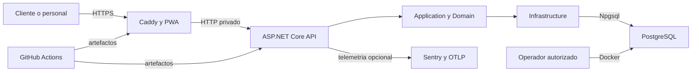

# Modelo de amenazas — Lou Barbershop

## Executive summary

Lou Barbershop es una PWA monolítica de una sola sucursal. Sus riesgos principales son el acceso cruzado entre barberos, el robo del enlace de gestión de una reserva pública, la alteración o repetición de operaciones económicas, la pérdida de PostgreSQL y una configuración incorrecta del proxy al exponerla en Internet. El diseño ya reduce estos riesgos con autorización en servidor, propiedad de recursos, antiforgery, tokens públicos hasheados, transacciones, idempotencia, auditoría y una red privada para API/base; las prioridades restantes se concentran en operación productiva, copias, monitoreo y configuración exacta del futuro despliegue.

## Scope and assumptions

- En alcance: `src/backend`, `src/frontend`, `deploy`, `compose*.yaml`, `.github/workflows` y configuración relacionada.
- El dueño confirmó una sola sucursal, pocos usuarios internos y una futura publicación en Railway; por ahora sólo se ejecuta localmente.
- Se asume un único negocio, sin multi-tenencia. La ruta pública de reserva será accesible en Internet y el área interna sólo mediante cookie autenticada.
- Los datos sensibles son nombre, teléfono, notas, credenciales internas e historial operativo/económico. No se procesan tarjetas: los pagos CASH/QR son registros internos.
- El único borde público previsto es Caddy; API y PostgreSQL deben permanecer en red privada. Confiar en cabeceras reenviadas sólo es seguro bajo esa condición.
- Fuera de alcance actual: infraestructura concreta de Railway, proveedor de backups, dominio/TLS definitivo, mensajería, pagos electrónicos, dispositivos del usuario y seguridad física.

Preguntas abiertas que pueden cambiar el riesgo: dominio y topología final de Railway; ubicación/retención legal exigida para backups y PII; proveedor final de Sentry/OTLP y personas que recibirán alertas. Estas decisiones quedan explícitamente diferidas al despliegue.

## System model

### Primary components

- React/Vite/Workbox presenta las rutas públicas e internas; las mutaciones usan HTTP same-origin y antiforgery (`src/frontend/src/infrastructure/http/apiClient.ts`, `src/frontend/vite.config.ts`).
- Caddy sirve la PWA, aplica cabeceras y reenvía `/api` y `/health` (`deploy/docker/Caddyfile`).
- ASP.NET Core Controllers autentica, autoriza, limita solicitudes y delega reglas a Application (`src/backend/LouBarbershop.Api/Program.cs`, `src/backend/LouBarbershop.Api/Controllers`).
- Application contiene casos de uso y puertos; Domain protege estados, dinero, disponibilidad y comisiones (`src/backend/LouBarbershop.Application`, `src/backend/LouBarbershop.Domain`).
- Infrastructure implementa Identity, EF Core, PostgreSQL, tokens y auditoría (`src/backend/LouBarbershop.Infrastructure`).
- GitHub Actions restaura, prueba, analiza dependencias e imágenes y produce SBOM (`.github/workflows/ci.yml`).

### Data flows and trust boundaries

- Internet → Caddy: HTML, JS, nombre/teléfono, token en cabecera y credenciales por HTTPS; Caddy limita cuerpo y aplica CSP/cabeceras. TLS será obligación del host productivo.
- Caddy → API: HTTP privado con JSON/cookies/cabeceras; API valida host, antiforgery, esquema, rol/propiedad, límite de solicitudes y tiempo. `Http:TrustForwardedHeaders` sólo se habilita si API no es pública.
- API → Application/Domain: DTOs normalizados y actor autenticado; el servidor recalcula precio, inventario, permisos, disponibilidad, comisiones y totales.
- Infrastructure → PostgreSQL: Npgsql/EF Core sobre red privada; transacciones, concurrencia, restricciones e historial auditable protegen integridad.
- API → Sentry/OTLP opcional: eventos, métricas y trazas sin PII por configuración; el endpoint y DSN serán secretos de plataforma.
- Operador → Docker/backup: comandos locales privilegiados producen un dump cifrable fuera del contenedor y restauran sólo en destino aislado durante la prueba.
- GitHub → registries/actions: código y manifests obtienen paquetes/imágenes; versiones, auditoría, Trivy, Dependabot y SBOM reducen riesgo de cadena de suministro.

#### Diagram

## Assets and security objectives

| Asset | Why it matters | Security objective (C/I/A) |
|---|---|---|
| Nombre, teléfono y notas | Su exposición perjudica clientes y confianza | C/I |
| Hashes de contraseña, cookies y tokens públicos | Permiten suplantación o acceso puntual | C/I |
| Roles y vínculo usuario–barbero | Definen alcance de cada empleado | I |
| Citas y disponibilidad | Sostienen la operación y evitan dobles reservas | I/A |
| Cobros, inventario, comisiones y liquidaciones | Su alteración causa pérdida económica | I/A |
| Auditoría e idempotencia | Permiten investigar y evitar duplicados | I/A |
| PostgreSQL y backups | Contienen el historial íntegro del negocio | C/I/A |
| Claves Data Protection y secretos de despliegue | Protegen sesiones e integraciones | C/I/A |
| Imágenes, paquetes y SBOM | Determinan qué código llega a producción | I/A |

## Attacker model

### Capabilities

- Visitante remoto puede automatizar rutas públicas, enviar JSON y cabeceras manipuladas, reutilizar un enlace que haya robado y provocar concurrencia.
- Usuario BARBER legítimo puede modificar identificadores e intentar acceder a recursos de otro barbero.
- Atacante con contraseña robada puede operar hasta que la cuenta/sesión sea revocada.
- Dependencia o imagen comprometida puede ejecutar código durante build o runtime.
- Operador equivocado puede desplegar variables inseguras o restaurar una copia en el destino incorrecto.

### Non-capabilities

- No se asume acceso previo al host, al repositorio privado, a secretos de plataforma ni a PostgreSQL privado.
- No existe límite de tenant que atravesar, procesamiento de archivos, `eval`, webhooks, consumidor de colas ni ingreso de tarjeta.
- Compromiso físico del dispositivo, malware del navegador y administración de Railway quedan fuera del control del repositorio.

## Entry points and attack surfaces

| Surface | How reached | Trust boundary | Notes | Evidence (repo path / symbol) |
|---|---|---|---|---|
| Reserva pública | `/api/v1/public/*` | Internet → API | Anónima, token por cabecera, antiforgery y rate limit | `PublicBookingController`; `PublicManagementTokenService` |
| Login/sesión | `/api/v1/auth/*` | Navegador → Identity | Cookie HttpOnly/Secure, lockout y respuesta no enumerable | `AuthController`; `Program.cs` |
| API interna | `/api/v1/*` | Personal → Controllers | Políticas y propiedad; JSON no confiable | `Controllers`; `AuthorizationPolicies.cs` |
| Reporte/CSV | `/api/v1/reports/*` | Dueño → datos derivados | Sólo OWNER, neutralización de fórmulas | `ReportsController`; `EfReportingStore` |
| Health | `/health/*` | Monitor → API | Sin detalles sensibles; readiness toca DB | `Program.cs`; `DatabaseReadinessHealthCheck` |
| Comandos operador | `--migrate`, `--bootstrap-owner`, `--recover-owner` | Host → API | Requieren acceso al host y secretos efímeros | `Program.cs`; `OwnerBootstrapper` |
| Backup/restauración | scripts PowerShell | Operador → PostgreSQL | Dump binario; restauración de verificación aislada | `deploy/backup.ps1`; `deploy/verify-backup-restore.ps1` |
| Cadena de suministro | push/PR | GitHub → build/registry | Paquetes, acciones e imágenes de terceros | `.github/workflows/ci.yml`; Dockerfiles |

## Top abuse paths

1. Un BARBER cambia un GUID → solicita una operación ajena → si falta propiedad ve PII o cobra por otro. Impacto: privacidad e integridad económica.
2. Un tercero obtiene `/book/manage#token` del dispositivo → envía el token en `X-Management-Token` → consulta o cambia la cita antes de caducar. Impacto: privacidad y disponibilidad puntual.
3. Un bot distribuye solicitudes por muchas IP → supera límites por partición → consume CPU/DB y agota horarios. Impacto: caída de reserva pública.
4. Un navegador malicioso fuerza una mutación con cookie → intenta omitir/forjar antiforgery → si el borde se configura mal altera agenda o economía. Impacto: integridad.
5. Un usuario repite un pago tras pérdida de red → intenta duplicar cobro/inventario/comisión → idempotencia/transacción deben devolver el cierre original. Impacto: pérdida económica.
6. Un proxy no confiable inyecta `X-Forwarded-For/Proto` → evade límite o aparenta HTTPS → debilita controles si API también es pública. Impacto: autenticación y disponibilidad.
7. Se pierde/corrompe el volumen PostgreSQL → se descubre que el dump no restaura → desaparece historial. Impacto: continuidad total.
8. Una dependencia comprometida entra por actualización → CI construye imagen maliciosa → roba secretos o modifica datos. Impacto: compromiso completo.

## Threat model table

| Threat ID | Threat source | Prerequisites | Threat action | Impact | Impacted assets | Existing controls (evidence) | Gaps | Recommended mitigations | Detection ideas | Likelihood | Impact severity | Priority |
|---|---|---|---|---|---|---|---|---|---|---|---|---|
| TM-001 | BARBER autenticado | Cuenta válida y GUID objetivo | Acceso cruzado a agenda/operación | Fuga de PII o alteración | PII, cobros, citas | Propiedad en `AgendaService`/`SalesService`; pruebas de roles | Mantener matriz negativa ruta por ruta | Ejecutar prueba T-014 en cada cambio de permisos | 403 por usuario/ruta fuera de patrón | media | alta | high |
| TM-002 | Tercero con enlace robado | Acceso al fragmento/dispositivo | Gestiona una cita durante vigencia | Consulta, reprogramación o cancelación | PII mínima, cita | 256 bits, hash, expiración, rotación y 404 común; ADR-018 | No existe recuperación/verificación secundaria | Reducir vigencia si operación lo permite; permitir revocación administrativa futura | Pico de 404/rate limit público | baja | media | medium |
| TM-003 | Sitio/navegador hostil | Sesión interna activa | CSRF o XSS para mutar estado | Alteración amplia según rol | Todos los datos operativos | Antiforgery global, SameSite, CSP, React escaping | Validar CSP en dominio real | Mantener same-origin; pruebas con cabeceras productivas | 400 antiforgery y violaciones CSP | baja | alta | medium |
| TM-004 | Usuario manipula JSON | Acceso público o interno | Envía precios, tasas, totales o estados falsos | Fraude/inconsistencia | Economía e inventario | Backend recalcula; Domain y transacciones (`SalesService`) | Regresión futura puede saltar caso de uso | Pruebas negativas de contratos y arquitectura | Conflictos/validaciones anómalos | baja | alta | medium |
| TM-005 | Cliente concurrente/reintento | Dos solicitudes o clave reutilizada | Duplica reserva, venta, pago o liquidación | Doble afectación | Agenda y economía | Exclusiones PG, versiones, transacción e idempotencia | Claves sólo para pago actual | Extender idempotencia a mutaciones externas si aparece evidencia | Conteo de 409 y claves repetidas | media | alta | high |
| TM-006 | Fallo operativo/ransomware | Volumen perdido o corrupción | Impide recuperar una base consistente | Parada/pérdida histórica | PostgreSQL, auditoría | Script de dump y restauración aislada; volúmenes | Backup diario/cifrado externo depende del despliegue | Programar copia, cifrado, retención y ensayo mensual en plataforma | Edad/éxito del último backup y restore drill | media | alta | high |
| TM-007 | Logs/telemetría mal configurados | Captura de cuerpo/query/PII habilitada | Exfiltra teléfono, token o credencial | Privacidad/suplantación | PII y autenticación | Logs estructurados sin cuerpos; token fuera de URL; Sentry sin PII | Proveedor final no configurado | Filtros/redacción y prueba de evento antes de producción | Muestreo automático de patrones sensibles | media | media | medium |
| TM-008 | Bot remoto | Internet y múltiples IP | Fuerza bruta o DoS distribuido | Indisponibilidad | API/DB, reservas | Límites global/login/público, timeout, cuerpo 1 MB | In-memory y por IP no frenan botnet/multi-instancia | WAF/límite de borde y captcha sólo con evidencia | 429, latencia, CPU, conexiones DB | media | media | medium |
| TM-009 | Proxy/operador | API expuesta y confianza amplia | Falsifica forwarded headers/Host | Evasión de límites o esquema | Sesión y disponibilidad | Confianza opt-in, un salto, AllowedHosts; red privada Compose | Topología Railway aún abierta | No publicar API; fijar hosts y prueba desde Internet | Host inválido, IP imposible, cambio de esquema | baja condicional | alta | medium |
| TM-010 | Proveedor/dependencia | Paquete, action o imagen comprometidos | Inserta código en build/runtime | Compromiso completo | Secretos, DB, artefactos | Versiones, audit, Trivy, Dependabot, SBOM, permisos CI read-only | Actions no fijadas por SHA | Fijar acciones por SHA antes de release y revisar SBOM/diffs | Alertas Dependabot/Trivy y cambios de SBOM | baja | alta | medium |

## Criticality calibration

- **Critical:** compromiso remoto sin autenticar de API/host; extracción completa de PostgreSQL; manipulación silenciosa general de cobros. No hay hallazgo abierto de esta clase.
- **High:** BARBER accede a datos ajenos; pérdida no recuperable de base; duplicación sistemática de pagos; secreto de producción expuesto.
- **Medium:** gestión de una cita con token robado; DoS recuperable; PII parcial en telemetría; proxy mal configurado bajo precondiciones.
- **Low:** información técnica sin datos, error ruidoso con recuperación inmediata o abuso que exige control previo del host sin ampliar privilegio.

## Focus paths for security review

| Path | Why it matters | Related Threat IDs |
|---|---|---|
| `src/backend/LouBarbershop.Api/Program.cs` | Pipeline, cookies, proxy, límites, Sentry/OTLP | TM-003, TM-007–009 |
| `src/backend/LouBarbershop.Api/Controllers` | Frontera de autenticación/autorización y binding | TM-001, TM-003–005 |
| `src/backend/LouBarbershop.Application/Sales/SalesService.cs` | Cobro, propiedad, idempotencia y efectos atómicos | TM-001, TM-004–005 |
| `src/backend/LouBarbershop.Application/Agenda/AgendaService.cs` | Propiedad y doble reserva | TM-001, TM-005 |
| `src/backend/LouBarbershop.Application/PublicBooking` | Acceso anónimo y gestión puntual | TM-002, TM-005, TM-008 |
| `src/backend/LouBarbershop.Infrastructure/Security` | Entropía y hash del token | TM-002 |
| `src/backend/LouBarbershop.Infrastructure/Persistence/AppDbContext.cs` | Persistencia/auditoría y datos sensibles | TM-004, TM-006–007 |
| `deploy/docker/Caddyfile` | Borde público, CSP y proxy | TM-003, TM-008–009 |
| `compose.yaml` | Aislamiento, secretos y privilegios | TM-006, TM-009 |
| `deploy/backup.ps1` | Producción del artefacto de recuperación | TM-006 |
| `.github/workflows/ci.yml` | Cadena de suministro y artefactos | TM-010 |
| `src/frontend/src/infrastructure/http` | Cookies, antiforgery y token público | TM-002–003 |

## Quality check

- Cubiertos endpoints públicos, autenticación, API interna, salud, comandos de operador, backups y CI.
- Cada frontera del diagrama aparece al menos en una amenaza.
- Runtime, operación, build/CI y elementos fuera de alcance están separados.
- Se incorporaron las decisiones previas del dueño: una sucursal, local ahora, Railway después y sin datos reales.
- Las preguntas dependientes del despliegue permanecen abiertas y no se presentan como controles activos.
