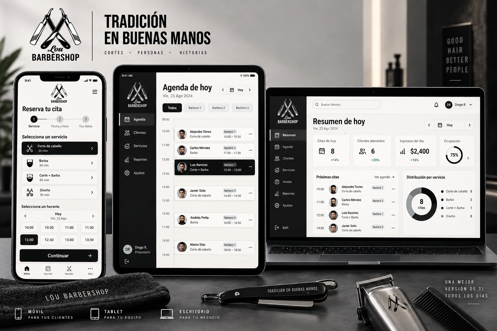
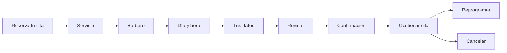
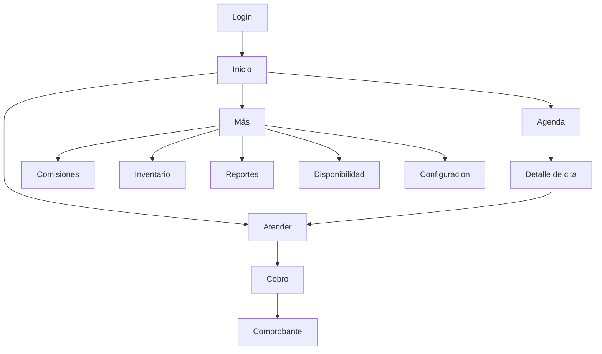

# Propuesta de diseño visual — Lou Barbershop

**Estado:** aprobada e implementada el 9 de septiembre de 2026  
**Fuente visual:** logo entregado por el dueño  
**Alcance:** PWA pública e interna, móvil, tablet y escritorio

La evidencia técnica y visual está registrada en [46-acta-implementacion-diseno-visual.md](46-acta-implementacion-diseno-visual.md).

## 1. Lectura de la marca

El logo combina cuatro señales claras:

- negro y blanco de contraste alto;
- navajas cruzadas, simetría y precisión;
- `Lou` en lettering gestual y personal;
- `BARBERSHOP` condensado, firme y funcional.

La interfaz debe sentirse **precisa, directa, artesanal y contemporánea**. No debe parecer un sistema corporativo genérico, un salón de belleza pastel ni una barbería temática recargada. La personalidad estará en la composición, tipografía, contraste, fotografía real futura y pequeños detalles metálicos; los datos operativos seguirán siendo muy legibles.

## 2. Dirección visual propuesta

La imagen anterior es una referencia conceptual generada con el logo como inspiración. No define datos, moneda, nombres, fotografías ni una reproducción válida del logo. La aplicación real seguirá usando BOB, datos autorizados y el archivo de marca original; los avatares serán iniciales hasta contar con fotografías y consentimiento.

### Concepto

**“Precisión en cada turno.”** Una base monocromática inspirada en el logo, con mucho aire, estructura editorial y controles rápidos. El área pública se siente premium y acogedora; el área interna es más compacta y operativa, pero ambas comparten los mismos componentes.

### Paleta

| Token | Valor | Uso |
|---|---:|---|
| `--color-ink` | `#080808` | navegación, CTA principal, texto fuerte |
| `--color-charcoal` | `#171717` | superficies oscuras y navegación secundaria |
| `--color-graphite` | `#2B2B2B` | texto secundario sobre oscuro |
| `--color-steel` | `#A7A7A7` | bordes, iconos y detalles metálicos |
| `--color-fog` | `#DEDEDA` | divisores y estados deshabilitados |
| `--color-paper` | `#F5F3EE` | fondo cálido principal |
| `--color-white` | `#FFFFFF` | tarjetas y texto sobre negro |

Colores semánticos aparecen sólo donde aportan significado: verde oscuro para éxito, ámbar para advertencia y borgoña para error/anulación. Nunca sustituyen texto o icono y no se usan como decoración de marca.

### Tipografía

- **Títulos y cifras destacadas:** `Barlow Condensed`, peso 600–700, autoalojada.
- **Texto, formularios y tablas:** `Inter`, peso 400–700, autoalojada.
- **Lettering:** únicamente la palabra `Lou` dentro del logo original.
- Importes usan números tabulares para alinear centavos.

La tipografía exacta del logo no se adivina ni se reemplaza. Si más adelante se obtiene el archivo vectorial o nombre de fuente original, se registra como activo de marca.

### Forma y textura

- radios de 8–12 px; evitar tarjetas excesivamente redondeadas;
- bordes finos negros/grises y sombras muy suaves;
- botones principales negros, sólidos y de ancho completo en móvil;
- líneas y pequeños cortes diagonales inspirados en la navaja, sólo en encabezados o separadores;
- superficies de datos limpias, sin texturas detrás de tablas o importes;
- iconografía lineal consistente; mínimo 20 px y área táctil de 44 px.

## 3. Tecnologías y criterio de implementación

Se conserva el stack existente:

- React 19 y TypeScript estricto;
- React Router 7 para rutas, navegación y transiciones;
- TanStack Query para estados de servidor;
- React Hook Form + Zod para formularios;
- Vite, Workbox y `vite-plugin-pwa`;
- Storybook y pruebas de accesibilidad;
- CSS nativo con variables, capas y container queries.

No se necesita reemplazar React ni introducir Material UI, Bootstrap o Tailwind. El sistema visual será propio y vivirá en `presentation`; las reglas de `core` no cambian. Los iconos pueden incorporarse como SVG accesibles dentro de un adaptador visual. Las transiciones usan CSS y View Transitions cuando estén disponibles, con degradación segura; no se añade una librería de animación hasta demostrar una necesidad real.

## 4. Arquitectura de navegación

### Área pública

El flujo mantiene una sola decisión principal por pantalla. En móvil, un resumen compacto permanece visible antes de continuar. Volver atrás conserva las selecciones; recargar recupera únicamente estado no sensible permitido. Sin conexión se bloquea confirmar, reprogramar o cancelar.

### Área interna

- **Móvil:** barra inferior fija con `Inicio`, `Agenda`, `Atender` y `Más`.
- **Tablet:** rail lateral compacto; agenda y detalle pueden compartir pantalla.
- **Escritorio:** sidebar de 240 px, buscador/contexto arriba y contenido central.
- La navegación se adapta al rol: no muestra accesos que el usuario no puede usar.
- `Atrás` del navegador funciona; modales profundos no sustituyen rutas importantes.

El inicio por rol cambia: dueño ve resumen, administración abre agenda y barbero abre `Mi día`.

## 5. Inventario de pantallas

### Públicas

| Pantalla | Propósito | Decisión principal |
|---|---|---|
| Portada/reserva | iniciar sin cuenta | `Reservar cita` |
| Servicio | elegir necesidad | servicio |
| Barbero | elegir persona o cualquiera | preferencia |
| Fecha y hora | seleccionar disponibilidad | slot |
| Datos | nombre y teléfono mínimos | continuar |
| Revisión | evitar errores | confirmar |
| Confirmación | comunicar resultado y enlace | guardar/gestionar |
| Gestionar cita | consultar, reprogramar o cancelar | acción de cita |
| Sin conexión/enlace inválido | explicar y recuperar | reintentar/volver |

### Internas compartidas

| Pantalla | Cambio visual principal |
|---|---|
| Login | logo real protagonista, formulario corto y sin etiquetas de fase |
| Inicio | prioridades del día, no menú duplicado en tarjetas |
| Agenda/Mi día | línea horaria, filtros pegajosos y estados legibles |
| Detalle de cita | drawer en tablet/escritorio; pantalla completa en móvil |
| Atención | resumen del cliente, servicios/productos y total siempre visibles |
| Cobro | selector CASH/QR/mixto, diferencia en tiempo real y confirmación inequívoca |
| Estados de sesión/PWA | mensajes breves, acción clara y marca consistente |

### Dueño y administración

| Pantalla | Organización propuesta |
|---|---|
| Resumen | 4 métricas esenciales + próximas citas + alertas |
| Reportes | pestañas `Operación`, `Caja`, `Comisiones`, `Equipo`, `Auditoría` |
| Inventario y gastos | pestañas separadas, búsqueda y alertas de stock |
| Comisiones | saldo por barbero, período y trazabilidad al detalle |
| Disponibilidad | calendario de horarios y excepciones |
| Configuración | categorías: equipo, servicios, productos, comisiones y usuarios |

Los reportes dejan de ser una única página interminable. Cada pestaña conserva filtros y permite profundizar sin perder el período seleccionado.

## 6. Componentes base

- `BrandLockup`: logo completo, isotipo y variantes claro/oscuro.
- `AppSidebar`, `MobileTabBar`, `PageHeader` y `UserMenu`.
- `PrimaryButton`, `SecondaryButton`, `DangerButton` e `IconButton`.
- `Field`, `Select`, `MoneyInput`, `DatePicker` y `SearchField`.
- `StatusBadge`, siempre con texto e icono.
- `MetricCard`, `AppointmentCard`, `TimeSlot` y `EmptyState`.
- `BottomSheet` móvil y `SidePanel` para detalle contextual.
- `ConfirmDialog` para cobros, reversos, anulaciones y liquidaciones.
- `Toast` para confirmación no crítica; los errores permanecen junto al campo/acción.
- `Skeleton` con la misma geometría del contenido para evitar saltos.

Los componentes reciben datos ya preparados y no calculan precio, comisión, permisos o inventario.

## 7. Movimiento entre páginas y microinteracciones

| Evento | Movimiento | Duración |
|---|---|---:|
| cambio de ruta del mismo nivel | desvanecer + desplazamiento vertical de 6 px | 160–200 ms |
| avanzar en reserva | contenido entra desde la derecha; resumen permanece | 200–240 ms |
| volver en reserva | dirección inversa | 180–220 ms |
| abrir detalle | bottom sheet móvil / panel lateral tablet | 200 ms |
| selección de horario | borde/fondo cambian sin alterar tamaño | 120 ms |
| navegación activa | indicador se desliza dentro del rail/tab | 160 ms |
| éxito de guardado | check breve + mensaje persistente | 180–240 ms |
| error | sin sacudidas; foco y mensaje inmediato | 0–120 ms |

Reglas:

- `prefers-reduced-motion: reduce` elimina desplazamientos y deja cambios instantáneos o fades mínimos;
- nunca retrasar una operación económica para completar una animación;
- evitar spinners largos: skeleton en lectura y progreso textual en mutaciones;
- prevenir doble toque deshabilitando la acción y mostrando estado `Procesando…`;
- una actualización del service worker se solicita, nunca reemplaza la pantalla durante un cobro.

## 8. Comportamiento responsive

| Rango | Diseño |
|---|---|
| 320–639 px | una columna, barra inferior, CTA fijo cuando sea seguro |
| 640–1023 px | rail lateral, dos paneles para agenda/detalle, tablas adaptadas |
| 1024 px o más | sidebar completa, contenido máximo 1440 px y panel contextual |

Se prefieren container queries para componentes reutilizables. Las tablas económicas cambian a filas-resumen en móvil; no se comprimen hasta volver ilegibles ni dependen de scroll horizontal para la acción principal.

## 9. Accesibilidad y contenido

- contraste AA como mínimo y foco visible blanco/negro de doble anillo;
- áreas táctiles mínimas de 44 × 44 px;
- cuerpo mínimo equivalente a 16 px en móvil;
- estados comunicados por texto + icono + forma, no sólo color;
- orden de foco idéntico al visual y cierre/restauración de foco en panels;
- importes siempre con `Bs` y dos decimales en presentación;
- fechas naturales para operación (`Hoy, mié. 9`) y formato completo en detalle;
- lenguaje directo: `Cobrar`, `Guardar cita`, `Anular gasto`, no términos técnicos.

## 10. Secuencia de implementación

1. Preparar variantes autorizadas del logo, fuentes, tokens y componentes fundamentales.
2. Rehacer el shell responsive y la navegación por rol.
3. Rediseñar login, reserva pública y gestión de cita.
4. Rediseñar agenda, detalle, atención y cobro.
5. Dividir y rediseñar comisiones, inventario, reportes y configuración.
6. Actualizar Storybook, pruebas, capturas móvil/tablet/escritorio y PWA.
7. Ejecutar aceptación visual y de tareas antes de desplegar.

Cada incremento debe mantener contratos API, reglas de negocio y protección offline existentes. El rediseño no reabre cálculos ni agrega funcionalidades fuera del MVP.

## 11. Criterios de aceptación visual

- El logo real reemplaza la `L` provisional sin perder legibilidad a 32 px.
- No quedan textos internos como `Fase 7`, `Fase 11` o etiquetas técnicas visibles al usuario.
- Las cuatro tareas frecuentes están a un toque en móvil.
- Ninguna navegación interna se desborda horizontalmente a 320 px.
- Reserva, agenda, atención y cobro completan su flujo con una acción primaria inequívoca.
- Reportes e inventario no producen páginas móviles interminables sin agrupación.
- Todos los estados tienen loading, vacío, éxito, error, offline y sin permiso.
- Lighthouse/accesibilidad automática no presenta errores críticos y la prueba por teclado pasa.
- Capturas a 390 × 844, 768 × 1024 y 1440 × 900 mantienen jerarquía consistente.
- Dueño, administración y barbero reconocen la aplicación como Lou Barbershop, no como una plantilla genérica.

## 12. Decisiones confirmadas por el dueño

El dueño aprobó iniciar la implementación con estas decisiones:

- dirección monocromática negro/blanco/acero;
- uso de fondo blanco cálido en lugar de blanco puro para áreas largas;
- `Barlow Condensed + Inter` como familia funcional;
- navegación inferior móvil y sidebar en tablet/escritorio;
- fotografías reales opcionales únicamente cuando existan permisos.

Precios, porcentajes, horarios y nombres mostrados en cualquier mockup son ficticios y no constituyen configuración del negocio.
